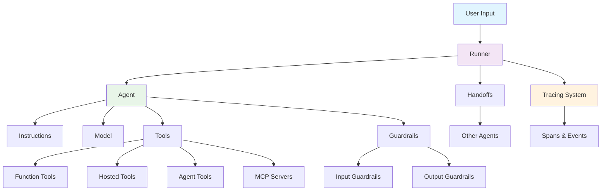
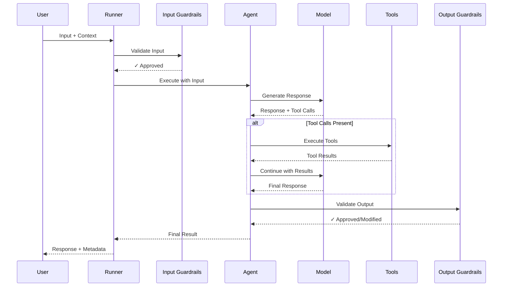
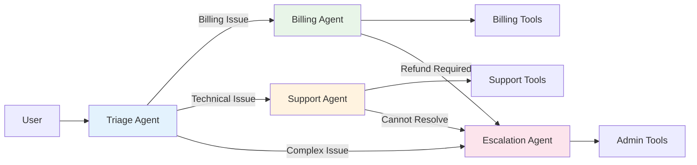

# OpenAI Agents JS SDK - Knowledge Base

This is the canonical entry point for comprehensive knowledge about the OpenAI Agents JS SDK.

> **Official Documentation**: [https://openai.github.io/openai-agents-js/](https://openai.github.io/openai-agents-js/)

## SDK Architecture Overview



## Agent Execution Flow



## Quick Start

```bash
npm install @openai/agents zod@3
```

```typescript
import { Agent, run } from '@openai/agents';

const agent = new Agent({
  name: 'Assistant',
  instructions: 'You are a helpful assistant',
});

const result = await run(agent, 'Write a haiku about recursion');
console.log(result.finalOutput);
```

## Core Concepts

The SDK is built around these key primitives:

- **Agents**: LLMs with instructions, tools, and configuration
- **Tools**: Function calls, hosted services, agent delegation, MCP servers
- **Handoffs**: Agent-to-agent delegation mechanism
- **Guardrails**: Input/output validation and safety controls
- **Runner**: Execution engine managing agent loops and state
- **Tracing**: Comprehensive debugging and monitoring

## Essential Patterns

### Basic Agent Creation
```typescript
const agent = new Agent({
  name: 'Agent Name',
  instructions: 'Behavior description',
  model: 'gpt-4o',
  tools: [tools],
  modelSettings: { temperature: 0.7 }
});
```

### Function Tools
```typescript
const tool = tool({
  name: 'get_weather',
  description: 'Get weather for a city',
  parameters: z.object({ city: z.string() }),
  async execute({ city }) {
    return `Weather in ${city}: sunny`;
  }
});
```

### Agent Execution
```typescript
// Simple run
const result = await run(agent, input);

// With options
const result = await run(agent, input, {
  stream: true,
  context: data,
  maxTurns: 10
});
```

### Multi-Agent Handoffs
```typescript
const triageAgent = new Agent({
  name: 'Triage',
  handoffs: [billingAgent, supportAgent]
});
```

## Multi-Agent Orchestration



## Detailed Documentation

### Core Architecture
- [Core Concepts](docs/agents/core-concepts.md) - Detailed architecture and primitives
- [Agent Configuration](docs/agents/agent-configuration.md) - All configuration options and patterns

### Tool System
- [Tools System](docs/agents/tools-system.md) - Comprehensive tool creation and usage

### Multi-Agent Systems
- [Multi-Agent Patterns](docs/agents/multi-agent-patterns.md) - Handoffs and orchestration

### Real-time Features
- [Streaming & Realtime](docs/agents/streaming-realtime.md) - Real-time interactions and voice agents

### Safety & Production
- [Guardrails & Safety](docs/agents/guardrails-safety.md) - Validation and human-in-the-loop
- [Model Configuration](docs/agents/model-configuration.md) - Model settings and providers
- [Production Deployment](docs/agents/production-deployment.md) - Environment setup and best practices

## Quick Reference

### Installation & Setup
```bash
npm install @openai/agents zod@3
```

### Environment Variables
```bash
OPENAI_API_KEY=your_key_here
DEBUG=openai-agents:*  # Enable debug logging
```

### Supported Environments
- ✅ Node.js 22+, Deno 2.35+, Bun 1.2.5+
- ⚠️ Cloudflare Workers (limited), Browsers (no tracing)

### Key Imports
```typescript
import { Agent, run, Runner, tool, handoff } from '@openai/agents';
import { RealtimeAgent, RealtimeSession } from '@openai/agents/realtime';
import { z } from 'zod';
```

## Best Practices

1. **Agent Design**: Use clear, specific instructions and focused tool sets
2. **Tool Creation**: Write explicit descriptions and validate inputs rigorously
3. **Error Handling**: Implement proper error handling for all agent operations
4. **State Management**: Leverage conversation history and context appropriately
5. **Production**: Use tracing, configure guardrails, and monitor performance
6. **Security**: Never expose sensitive data in instructions or tool outputs

## Common Patterns

### Streaming with Progress
```typescript
const result = await run(agent, input, { stream: true });
for await (const event of result) {
  if (event.type === 'agent_updated_stream_event') {
    console.log('Progress:', event.data);
  }
}
```

### Human Approval Workflow
```typescript
const result = await run(agent, input);
if (result.interruptions.length > 0) {
  const approval = await getHumanApproval();
  if (approval) result.state.approve();
  else result.state.reject();
  await runner.run(agent, result.state);
}
```

### Context-Aware Instructions
```typescript
const agent = new Agent({
  name: 'Assistant',
  instructions: async (context) =>
    `You are helping ${context.user}. Current time: ${new Date()}`
});
```

## Key Resources

### Official Documentation
- 📚 **Main Docs**: [https://openai.github.io/openai-agents-js/](https://openai.github.io/openai-agents-js/)
- 🚀 **Getting Started**: [https://openai.github.io/openai-agents-js/guides/getting-started](https://openai.github.io/openai-agents-js/guides/getting-started)
- 🔧 **Tools Guide**: [https://openai.github.io/openai-agents-js/guides/tools](https://openai.github.io/openai-agents-js/guides/tools)
- 🤝 **Handoffs**: [https://openai.github.io/openai-agents-js/guides/handoffs](https://openai.github.io/openai-agents-js/guides/handoffs)
- 🛡️ **Guardrails**: [https://openai.github.io/openai-agents-js/guides/guardrails](https://openai.github.io/openai-agents-js/guides/guardrails)
- 📊 **Tracing**: [https://openai.github.io/openai-agents-js/guides/tracing](https://openai.github.io/openai-agents-js/guides/tracing)
- 🎙️ **Realtime/Voice**: [https://openai.github.io/openai-agents-js/guides/realtime](https://openai.github.io/openai-agents-js/guides/realtime)

### API Reference
- 📖 **Full API**: [https://openai.github.io/openai-agents-js/api](https://openai.github.io/openai-agents-js/api)
- ⚡ **Realtime API**: [https://openai.github.io/openai-agents-js/api/realtime](https://openai.github.io/openai-agents-js/api/realtime)

---

For comprehensive implementation details, see the [detailed documentation](docs/agents/) directory.