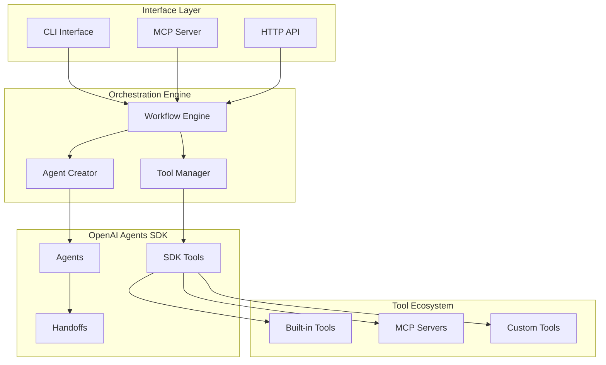

# Agents CLI – Multi-Agent Workflow Engine
## Product Requirements Document

## 1. Overview

Agents CLI is a programmatic multi-agent workflow engine that enables agentic IDEs (Cursor, Copilot, etc.) to dynamically create and execute sophisticated agent workflows using the OpenAI Agents SDK. The system provides both CLI and MCP server interfaces, allowing IDEs to define agents, tools, and orchestration patterns through JSON configuration and receive structured outputs for further processing.

### Document Role & Ownership
- This PRD defines the canonical requirements for building a multi-agent workflow engine optimized for IDE integration
- `README.md` provides quickstart and usage examples; this PRD details product architecture and implementation requirements
- Primary maintainers: Technical Lead (TL) and Product Owner (PO) approve updates and ensure alignment with IDE integration roadmap
- Change control: Updates via PRs with linked tracking issues; material changes summarized in Section 14

### How to Use This PRD
- Sections 1–3: Product vision, goals, and constraints
- Sections 4–7: Core requirements and technical architecture
- Sections 8–10: Implementation roadmap and extensibility
- Section 11: Open decisions, Section 12: Risk tracking

## 2. Goals & Success Metrics

**Primary Goals:**
- **G1**: Enable agentic IDEs to dynamically create and execute multi-agent workflows via JSON configuration in <5 seconds
- **G2**: Provide both CLI and MCP server interfaces for flexible IDE integration patterns
- **G3**: Support arbitrary agent definitions, tool integrations, and workflow patterns without code changes
- **G4**: Deliver structured, parseable outputs suitable for IDE consumption and further processing

**Success Metrics (90 days):**
- ≥3 agentic IDEs successfully integrate and execute workflows
- Median workflow execution time ≤30 seconds for typical code review scenarios
- ≥90% of workflows complete successfully with valid JSON output
- ≥5 different workflow patterns (code review, architecture analysis, debugging, etc.) in active use

## 3. Non-Goals

- **Not a standalone IDE**: This is a workflow engine, not a code editor
- **Not a GUI tool**: Purely programmatic interfaces (CLI + MCP)
- **Not a hosting service**: No cloud deployment or session persistence
- **Not a model provider**: Relies on OpenAI API, no local model support for MVP

## 4. Target Integration Patterns

| IDE Type | Integration Method | Use Case |
|----------|-------------------|----------|
| Cursor/VS Code | MCP Server | Real-time code analysis workflows |
| GitHub Copilot | CLI + JSON | PR review and validation workflows |
| JetBrains IDEs | CLI via plugins | Architecture review and refactoring |
| Custom IDEs | HTTP/REST API | Programmatic workflow execution |

## 5. Core User Stories

**As an Agentic IDE:**
1. I can define a multi-agent workflow via JSON config and execute it programmatically
2. I can access file system, git operations, and web search through pre-built tool integrations
3. I can receive streaming progress updates and structured final outputs
4. I can integrate via MCP protocol for real-time workflow execution

**As a Workflow Author:**
1. I can define agents with specific roles, tools, and handoff patterns
2. I can specify different orchestration patterns (sequential, parallel, conditional)
3. I can configure tool access and guardrails per agent
4. I can template common workflows for reuse across projects

## 6. Functional Requirements

### FR1 – Dual Interface Support
**CLI Mode:**
```bash
agents-cli run --config workflow.json --input "Review this code" --output results.json
agents-cli validate --config workflow.json  # Dry run validation
```

**MCP Server Mode:**
```bash
agents-cli serve --port 3000  # HTTP server for MCP protocol
```

### FR2 – Workflow Configuration Schema
**Agent Definition:**
```json
{
  "agents": {
    "code_reviewer": {
      "name": "Senior Code Reviewer",
      "instructions": "Review code for bugs, performance, and best practices",
      "model": "gpt-4o",
      "tools": ["file_operations", "git_tools", "web_search"],
      "guardrails": ["no_destructive_operations"],
      "handoffs": ["architect", "security_reviewer"]
    }
  },
  "workflow": {
    "entry_point": "code_reviewer",
    "pattern": "handoff_chain",
    "max_turns": 10,
    "timeout": 300
  },
  "tools": {
    "git_tools": {
      "type": "mcp_server",
      "config": {"server": "git-mcp-server"}
    }
  }
}
```

### FR3 – Tool Integration System
- **Built-in Tools**: File operations, git commands, web search
- **MCP Server Integration**: Auto-discovery and connection
- **Custom Function Tools**: Definable via configuration
- **Tool Guardrails**: Per-agent access control and safety limits

### FR4 – Workflow Orchestration Patterns
- **Handoff Chain**: Sequential agent delegation
- **Parallel Processing**: Multiple agents working simultaneously
- **Conditional Routing**: Dynamic agent selection based on context
- **Review Loops**: Iterative refinement patterns

### FR5 – Output & Streaming
**Real-time Streaming:**
```json
{
  "type": "progress",
  "agent": "code_reviewer",
  "message": "Analyzing file structure...",
  "timestamp": "2024-01-01T12:00:00Z"
}
```

**Final Structured Output:**
```json
{
  "workflow_id": "uuid",
  "status": "completed",
  "results": {
    "summary": "Code review completed with 3 issues found",
    "agents_used": ["code_reviewer", "security_reviewer"],
    "findings": [...],
    "recommendations": [...],
    "metadata": {...}
  }
}
```

### FR6 – Configuration Validation & Error Handling
- **Schema Validation**: Zod-based configuration validation
- **Pre-flight Checks**: Tool availability, API connectivity, file access
- **Graceful Degradation**: Continue workflow if non-critical tools fail
- **Structured Errors**: Machine-readable error responses for IDE consumption

## 7. Non-Functional Requirements

- **Performance**: Workflow startup <3s, streaming updates <500ms latency
- **Reliability**: Auto-retry failed API calls, graceful error recovery
- **Security**: No API key logging, configurable access controls, safe tool execution
- **Scalability**: Handle concurrent workflows (MCP server mode)
- **Portability**: Cross-platform support (macOS, Linux, Windows)

## 8. Technical Architecture

### Core Components



### Technology Stack
- **Runtime**: Node.js 18+, TypeScript
- **CLI Framework**: Commander.js
- **Validation**: Zod for schema validation
- **OpenAI Integration**: OpenAI Agents SDK
- **MCP Protocol**: Official MCP TypeScript implementation
- **Streaming**: Server-Sent Events / WebSockets
- **Configuration**: JSON/YAML with schema validation

## 9. Implementation Roadmap

This project follows a structured implementation approach with detailed task breakdowns:

### **📋 Detailed Implementation Plans**

- **[Phase 0: Repository & Documentation Foundation](tasks/phase0.md)** *(3-4 days)*
  - GitHub repository setup with open source best practices
  - Complete documentation site with GitHub Pages
  - Legal framework (MIT license, security policy, contributing guidelines)
  - Community templates and PR workflows

- **[Phase 1: Core Development Foundation](tasks/phase1.md)** *(2 weeks)*
  - CLI interface with basic workflow execution
  - MCP server for IDE integration
  - Configuration system with JSON schema validation
  - Security framework with tool sandboxing
  - OpenAI Agents SDK integration with adapter pattern
  - Comprehensive testing and quality assurance

### **🔄 Future Phases** *(Post-MVP)*

- **Phase 2**: Advanced tool integrations and parallel workflow patterns
- **Phase 3**: Production features, performance optimization, and enhanced MCP compliance
- **Phase 4**: Workflow templates, IDE-specific integrations, and community ecosystem

## 10. Extensibility Roadmap (Post-MVP)

- **Workflow Templates**: Pre-built patterns for common IDE scenarios
- **Plugin System**: Third-party tool and agent extensions
- **Workflow Composition**: Nested and composite workflows
- **State Persistence**: Resume interrupted workflows
- **Analytics**: Usage metrics and performance tracking
- **Multi-Model Support**: Beyond OpenAI (Anthropic, local models)

## 11. Open Questions

- **MCP Protocol Version**: Which MCP specification version to target?
- **Workflow State Management**: In-memory vs. persistent state for long-running workflows?
- **Tool Discovery**: Auto-discovery mechanisms for MCP servers and tools?
- **Rate Limiting**: How to handle API rate limits across concurrent workflows?
- **Security Model**: Fine-grained permissions for tool access in IDE contexts?

## 12. Risks & Mitigations

| Risk | Impact | Mitigation |
|------|--------|------------|
| OpenAI Agents SDK API changes | High | Adapter layer + SDK version pinning |
| MCP protocol evolution | Medium | Abstract MCP interface + version compatibility |
| Tool integration complexity | Medium | Standardized tool interface + comprehensive testing |
| IDE adoption friction | Medium | Clear documentation + working examples |
| Performance at scale | Medium | Benchmarking + optimization from early phases |

## 13. Success Criteria & Validation

**Technical Validation:**
- Can execute code review workflow in <30 seconds
- Successfully integrates with ≥2 MCP servers
- Handles ≥10 concurrent workflows without degradation
- 99%+ configuration validation accuracy

**Integration Validation:**
- Working integration with Cursor/VS Code via MCP
- CLI integration with GitHub Actions workflows
- Community adoption of workflow templates
- Positive feedback from early adopter IDEs

## 14. References & Dependencies

**📚 Technical Documentation:**
- [OpenAI Agents JS SDK Documentation](https://openai.github.io/openai-agents-js/)
- [Model Context Protocol Specification](https://spec.modelcontextprotocol.io/)
- [AGENTS.md](AGENTS.md) - OpenAI Agents SDK knowledge base and integration guide

**📋 Implementation References:**
- [Phase 0 Task Breakdown](tasks/phase0.md) - Repository foundation and documentation setup
- [Phase 1 Task Breakdown](tasks/phase1.md) - Core development and MCP implementation
- IDE Integration Examples (to be created during Phase 1)

## 15. Document Maintenance

**Review Cycle**: TL + PO review before each sprint planning
**Updates**: Material changes require PR with justification
**Cross-References**: Keep README.md and integration docs aligned

| Document | Purpose | Owner |
|----------|---------|-------|
| docs/PRD.md | Product requirements and canonical task entrypoint | PO + TL |
| docs/tasks/phase0.md | Repository foundation task breakdown | TL |
| docs/tasks/phase1.md | Core development task breakdown | TL |
| AGENTS.md | OpenAI Agents SDK knowledge base | TL |
| README.md | Quickstart and basic usage | TL |
| docs/workflows/ | Example workflow configurations | Community |
| docs/integration/ | IDE integration guides | TL |

---

*This PRD defines a multi-agent workflow engine optimized for agentic IDE integration. Implementation should prioritize IDE usability, programmatic interfaces, and extensible workflow patterns.*