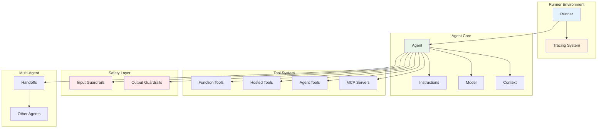
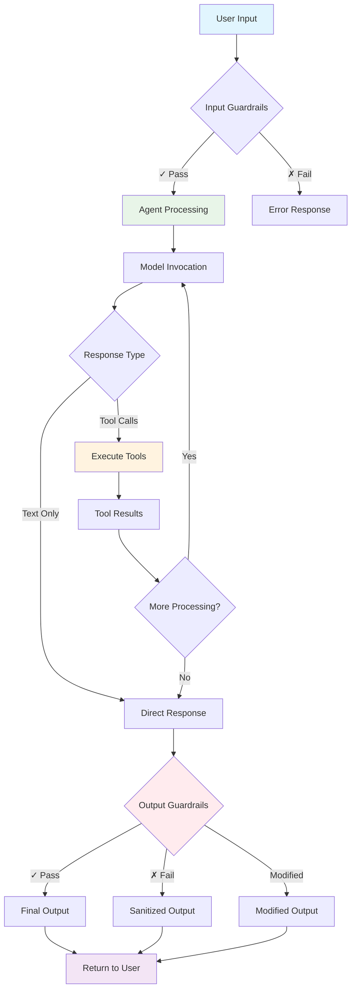

# Core Concepts - OpenAI Agents JS SDK

This document provides detailed understanding of the fundamental architecture and concepts in the OpenAI Agents JS SDK.

> **Official Guide**: [https://openai.github.io/openai-agents-js/guides/agents](https://openai.github.io/openai-agents-js/guides/agents)

## Architecture Overview

The SDK is designed with two core principles:
1. **Feature-rich** - Comprehensive capabilities for complex agent workflows
2. **Simple to learn** - Intuitive APIs and lightweight primitives



## Core Primitives

### 1. Agents

Agents are LLMs configured with:
- **Instructions**: System prompt defining behavior
- **Model**: LLM selection (GPT-4o, GPT-5, etc.)
- **Tools**: Available function calls
- **Context**: Dynamic data injection
- **Output Type**: Structured response schema

```typescript
const agent = new Agent({
  name: 'Customer Support',
  instructions: 'Help customers with billing questions',
  model: 'gpt-4o',
  tools: [billingTool, escalationTool],
  modelSettings: { temperature: 0.3 }
});
```

### 2. Tools

Four distinct tool types enable agent capabilities:

#### Function Tools
```typescript
const weatherTool = tool({
  name: 'get_weather',
  description: 'Get current weather for a city',
  parameters: z.object({
    city: z.string().describe('City name'),
    units: z.enum(['celsius', 'fahrenheit']).optional()
  }),
  async execute({ city, units = 'celsius' }) {
    const weather = await fetchWeather(city);
    return formatWeather(weather, units);
  }
});
```

#### Hosted Tools
Built-in OpenAI services:
- `webSearchTool()` - Web search capabilities
- `fileSearchTool()` - Document search and retrieval
- `codeInterpreterTool()` - Code execution environment
- `computerUseTool()` - Computer interaction

#### Agent Tools
```typescript
const supportAgent = new Agent({ /* config */ });
const escalationTool = supportAgent.asTool();

const triageAgent = new Agent({
  name: 'Triage',
  tools: [escalationTool]
});
```

#### MCP Servers
```typescript
const mcpTool = new MCPServerStdio({
  command: 'node',
  args: ['./mcp-server.js']
});
```

### 3. Runner

The execution engine managing agent loops:

```typescript
const runner = new Runner();

// Configure default settings
runner.setDefaultModel('gpt-4o');
runner.setDefaultMaxTurns(15);

// Execute with custom options
const result = await runner.run(agent, input, {
  stream: true,
  context: { user: 'john_doe', session: 'abc123' },
  maxTurns: 10,
  signal: abortController.signal
});
```

#### Agent Loop Mechanics

1. **Input Processing**: Receive user input and context
2. **Guardrail Check**: Validate input if guardrails configured
3. **Model Invocation**: Call LLM with instructions and tools
4. **Response Analysis**: Parse model response for:
   - Final text output
   - Tool calls to execute
   - Handoff requests
5. **Tool Execution**: Execute requested tools in parallel
6. **Iteration**: Repeat until completion or max turns
7. **Output Validation**: Apply output guardrails
8. **Result Return**: Provide final result with metadata

### 4. Handoffs

Agent delegation mechanism for specialized tasks:

```typescript
const billingAgent = new Agent({
  name: 'Billing Specialist',
  instructions: 'Handle billing inquiries and payment issues'
});

const refundAgent = new Agent({
  name: 'Refund Specialist',
  instructions: 'Process refund requests'
});

const triageAgent = new Agent({
  name: 'Customer Triage',
  instructions: 'Route customers to appropriate specialists',
  handoffs: [billingAgent, refundAgent]
});
```

Custom handoff with validation:
```typescript
const escalationHandoff = handoff(supportAgent, {
  inputType: z.object({
    reason: z.string(),
    priority: z.enum(['low', 'medium', 'high'])
  }),
  onHandoff: (context, input) => {
    console.log(`Escalating: ${input.reason} (${input.priority})`);
    // Log, metrics, notifications, etc.
  }
});
```

### 5. Guardrails

Safety and validation mechanisms:

#### Input Guardrails
```typescript
const inputGuardrail = async (input: string) => {
  if (containsInappropriateContent(input)) {
    throw new Error('Content violates policy');
  }

  if (input.length > 10000) {
    throw new Error('Input too long');
  }

  return { allowed: true };
};

const agent = new Agent({
  name: 'Assistant',
  instructions: 'Be helpful',
  inputGuardrails: [inputGuardrail]
});
```

#### Output Guardrails
```typescript
const outputGuardrail = async (output: string) => {
  const toxicity = await checkToxicity(output);
  if (toxicity > 0.8) {
    throw new Error('Output failed safety check');
  }

  return { allowed: true, modified: sanitizeOutput(output) };
};
```

### 6. Tracing

Comprehensive monitoring and debugging:

```typescript
import { withTrace } from '@openai/agents';

const result = await withTrace('customer-interaction', async () => {
  return await run(agent, customerQuery);
});

// Custom spans
import { trace } from '@openai/agents';

await trace.withSpan('validation', async (span) => {
  span.setAttributes({ input_length: input.length });
  const isValid = await validateInput(input);
  span.setAttributes({ is_valid: isValid });
  return isValid;
});
```

## Agent Execution Data Flow



## Agent Loop Mechanics

```mermaid
sequenceDiagram
    participant U as User
    participant R as Runner
    participant A as Agent
    participant M as Model
    participant T as Tools

    U->>R: run(agent, input)
    R->>A: Initialize with input

    loop Agent Loop (max turns)
        A->>M: Generate response
        M->>A: Response + tool calls

        alt Has tool calls
            A->>T: Execute tools in parallel
            T->>A: Tool results
        else
            break
        end
    end

    A->>R: Final response
    R->>U: Result + metadata
```

## State Management

### Conversation History
```typescript
// Automatic history preservation
const result1 = await run(agent, "What's the weather?");
const result2 = await run(agent, "What about tomorrow?", {
  history: result1.history
});
```

### State Serialization
```typescript
// Save state for resumption
const serializedState = JSON.stringify(result.state);

// Resume later
const restoredState = JSON.parse(serializedState);
const continuedResult = await run(agent, newInput, {
  state: restoredState
});
```

## Error Handling

Common error types:
- `MaxTurnsExceededError` - Agent loop exceeded turn limit
- `ModelBehaviorError` - Unexpected model response format
- `GuardrailExecutionError` - Guardrail validation failed
- `ToolExecutionError` - Tool execution failed

```typescript
try {
  const result = await run(agent, input);
} catch (error) {
  if (error instanceof MaxTurnsExceededError) {
    console.log('Agent reached turn limit:', error.turns);
  } else if (error instanceof GuardrailExecutionError) {
    console.log('Guardrail blocked:', error.guardrailName);
  }
}
```

## Performance Considerations

### Parallel Tool Execution
Tools are executed in parallel automatically when multiple tools are called in a single model response.

### Memory Management
- Conversation history grows with each turn
- Context is injected fresh on each run
- Consider truncating history for long conversations

### Model Selection
- GPT-4o: Balanced performance and capability
- GPT-5: Advanced reasoning, higher cost
- Custom models: Via model provider interface

## References

### Official Documentation
- 📚 [Main SDK Documentation](https://openai.github.io/openai-agents-js/)
- 🎯 [Agents Guide](https://openai.github.io/openai-agents-js/guides/agents)
- 🚀 [Running Agents](https://openai.github.io/openai-agents-js/guides/running-agents)
- 📊 [Results Handling](https://openai.github.io/openai-agents-js/guides/results)
- 🔧 [Tools Documentation](https://openai.github.io/openai-agents-js/guides/tools)
- 🛡️ [Guardrails Guide](https://openai.github.io/openai-agents-js/guides/guardrails)
- 📈 [Tracing & Debugging](https://openai.github.io/openai-agents-js/guides/tracing)

### API References
- 📖 [Core API Reference](https://openai.github.io/openai-agents-js/api)
- ⚙️ [Model Configuration](https://openai.github.io/openai-agents-js/guides/models)

This foundational understanding enables effective use of all advanced SDK features.