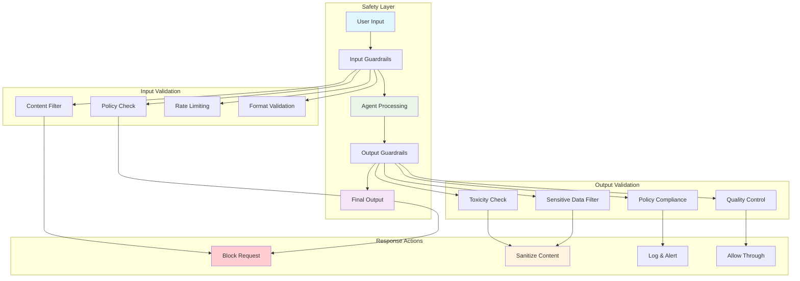
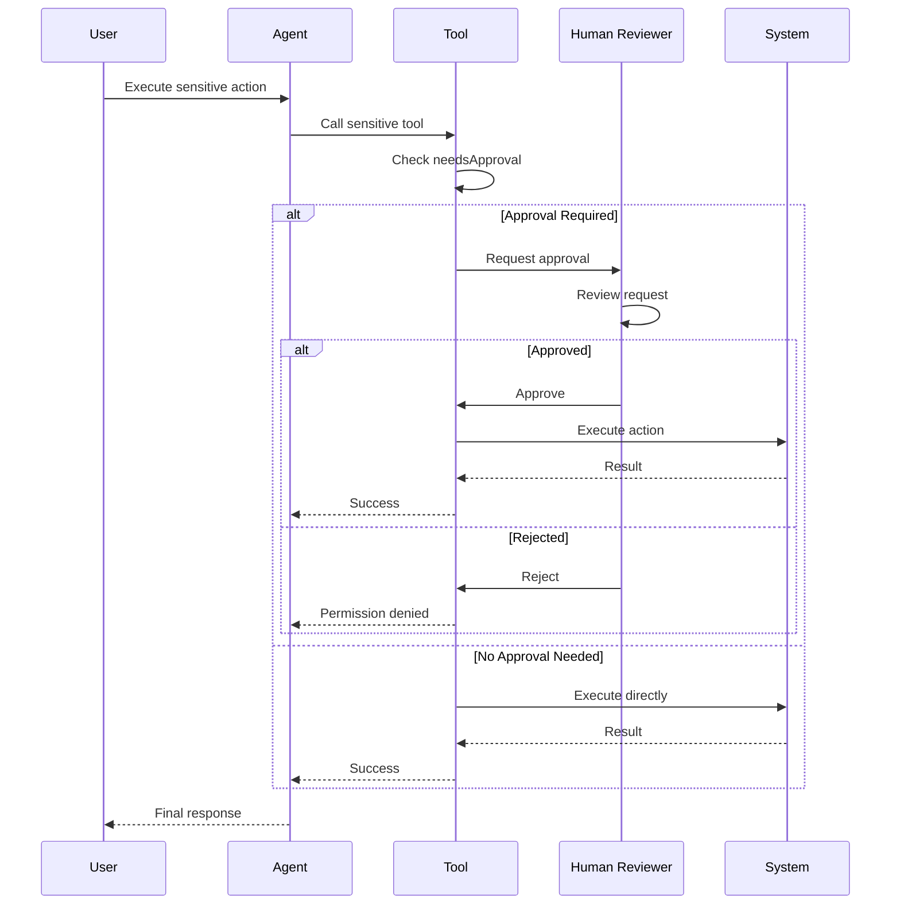
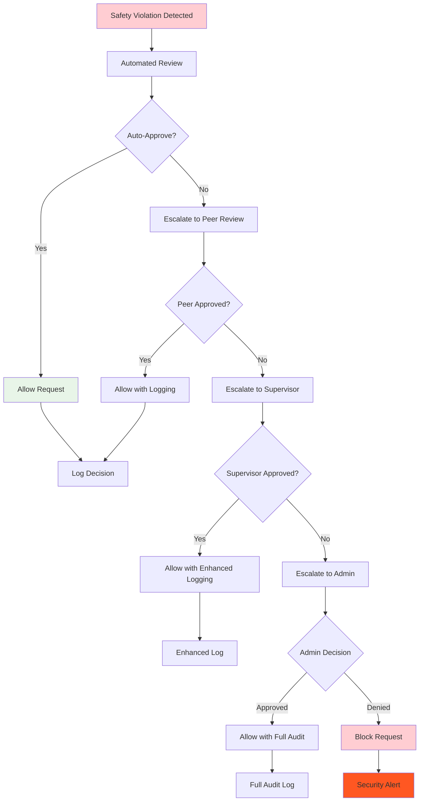
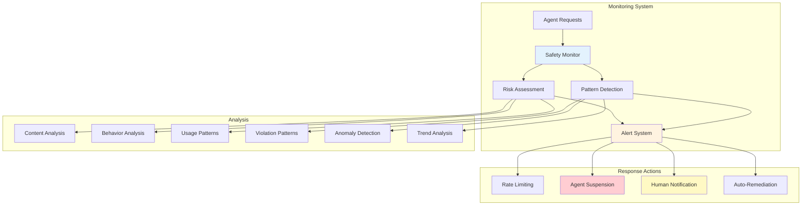
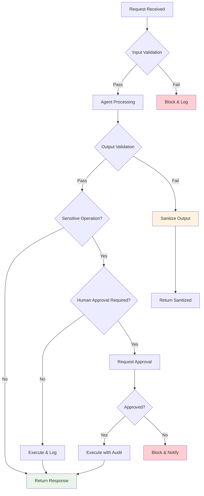

# Guardrails & Safety - OpenAI Agents JS SDK

Comprehensive guide to implementing safety controls, validation, and human oversight in agent systems.

> **Official Guide**: [https://openai.github.io/openai-agents-js/guides/guardrails](https://openai.github.io/openai-agents-js/guides/guardrails)

## Overview

Guardrails are parallel validation mechanisms that provide safety controls for agent systems. They operate independently of the main agent loop and can halt execution if safety or policy violations are detected.

## Safety Architecture



## Types of Guardrails

### Input Guardrails

Validate and filter user inputs before they reach the agent.

```typescript
import { Agent } from '@openai/agents';

const contentFilterGuardrail = async (input: string) => {
  // Check for inappropriate content
  if (containsProfanity(input)) {
    throw new Error('Input contains inappropriate language');
  }

  // Check for prompt injection attempts
  if (detectPromptInjection(input)) {
    throw new Error('Potential prompt injection detected');
  }

  // Length validation
  if (input.length > 10000) {
    throw new Error('Input exceeds maximum length limit');
  }

  return { allowed: true };
};

const agent = new Agent({
  name: 'Safe Assistant',
  instructions: 'Be helpful and appropriate',
  inputGuardrails: [contentFilterGuardrail]
});
```

### Output Guardrails

Validate agent responses before they're returned to users.

```typescript
const outputSafetyGuardrail = async (output: string) => {
  // Toxicity detection
  const toxicityScore = await checkToxicity(output);
  if (toxicityScore > 0.8) {
    throw new Error('Output failed toxicity check');
  }

  // Sensitive information detection
  if (containsSensitiveInfo(output)) {
    const sanitized = removeSensitiveInfo(output);
    return {
      allowed: true,
      modified: sanitized
    };
  }

  // Policy compliance check
  const policyViolation = await checkPolicyCompliance(output);
  if (policyViolation) {
    throw new Error(`Policy violation: ${policyViolation.reason}`);
  }

  return { allowed: true };
};

const agent = new Agent({
  name: 'Safe Assistant',
  instructions: 'Be helpful and appropriate',
  outputGuardrails: [outputSafetyGuardrail]
});
```

## Advanced Guardrail Patterns

### Context-Aware Guardrails

```typescript
const contextAwareGuardrail = async (input: string, context?: any) => {
  // Different rules based on user context
  if (context?.userAge && context.userAge < 18) {
    // Stricter content filtering for minors
    if (containsAdultContent(input)) {
      throw new Error('Content not appropriate for minors');
    }
  }

  if (context?.userRole === 'student') {
    // Prevent homework assistance
    if (detectHomeworkRequest(input)) {
      throw new Error('Cannot assist with homework assignments');
    }
  }

  if (context?.companyPolicy === 'restricted') {
    // Corporate policy enforcement
    if (violatesCorporatePolicy(input)) {
      throw new Error('Request violates company policy');
    }
  }

  return { allowed: true };
};
```

### Multi-Layer Validation

```typescript
class LayeredGuardrailSystem {
  private layers = [
    this.syntaxValidation,
    this.contentFiltering,
    this.policyCompliance,
    this.contextualAppropriateness
  ];

  async validateInput(input: string, context?: any) {
    const results = [];

    for (const [index, layer] of this.layers.entries()) {
      try {
        const result = await layer(input, context);
        results.push({
          layer: index,
          passed: true,
          result
        });
      } catch (error) {
        results.push({
          layer: index,
          passed: false,
          error: error.message
        });

        // Fail fast on first violation
        throw new Error(`Validation failed at layer ${index}: ${error.message}`);
      }
    }

    return {
      passed: true,
      results
    };
  }

  private async syntaxValidation(input: string) {
    // Basic syntax and format checks
    if (input.trim().length === 0) {
      throw new Error('Empty input not allowed');
    }

    // Character encoding validation
    if (!/^[\x00-\x7F]*$/.test(input) && !isValidUTF8(input)) {
      throw new Error('Invalid character encoding');
    }

    return { valid: true };
  }

  private async contentFiltering(input: string) {
    // Content-based filtering
    const categories = await classifyContent(input);

    const prohibited = ['hate-speech', 'violence', 'adult-content'];
    const detected = categories.filter(cat => prohibited.includes(cat.category));

    if (detected.length > 0) {
      throw new Error(`Prohibited content detected: ${detected.map(d => d.category).join(', ')}`);
    }

    return { categories };
  }

  private async policyCompliance(input: string, context?: any) {
    // Policy and regulatory compliance
    const violations = await checkCompliance(input, {
      gdpr: context?.region === 'EU',
      coppa: context?.userAge < 13,
      corporate: context?.companyPolicy
    });

    if (violations.length > 0) {
      throw new Error(`Policy violations: ${violations.join(', ')}`);
    }

    return { compliant: true };
  }

  private async contextualAppropriateness(input: string, context?: any) {
    // Context-specific appropriateness
    if (context?.setting === 'educational' && containsInappropriateEducationalContent(input)) {
      throw new Error('Content inappropriate for educational setting');
    }

    if (context?.setting === 'professional' && !isProfessionallyAppropriate(input)) {
      throw new Error('Content not professionally appropriate');
    }

    return { appropriate: true };
  }
}
```

### Agent-Based Guardrails

```typescript
const moderatorAgent = new Agent({
  name: 'Content Moderator',
  instructions: `
    You are a content moderation specialist. Analyze the provided content and determine if it:
    1. Contains inappropriate language or themes
    2. Violates community guidelines
    3. Contains harmful or dangerous information
    4. Is spam or low-quality content

    Respond with JSON: { "allowed": boolean, "reason": string, "confidence": number }
  `,
  outputType: z.object({
    allowed: z.boolean(),
    reason: z.string(),
    confidence: z.number().min(0).max(1)
  })
});

const agentBasedGuardrail = async (input: string) => {
  const result = await run(moderatorAgent, `
    Please analyze this content for safety and appropriateness:

    Content: "${input}"
  `);

  const analysis = result.finalOutput;

  if (!analysis.allowed) {
    throw new Error(`Content moderation failed: ${analysis.reason} (confidence: ${analysis.confidence})`);
  }

  return { allowed: true, analysis };
};
```

## Human-in-the-Loop Safety

## Human-in-the-Loop Flow



### Approval Workflows

```typescript
const sensitiveOperationTool = tool({
  name: 'sensitive_operation',
  description: 'Perform sensitive operation requiring approval',
  parameters: z.object({
    action: z.string(),
    target: z.string(),
    impact: z.enum(['low', 'medium', 'high'])
  }),
  needsApproval: (params) => {
    // Require approval for medium or high impact operations
    return ['medium', 'high'].includes(params.impact);
  },
  async execute({ action, target, impact }) {
    // Perform the sensitive operation
    await performSensitiveOperation(action, target);
    return `${action} performed on ${target} successfully`;
  }
});

// Handle approval workflow
const result = await run(agent, 'Delete the test database');

if (result.interruptions.length > 0) {
  console.log('⏸️ Operations requiring approval:');

  for (const interruption of result.interruptions) {
    console.log(`- ${interruption.tool_name}: ${JSON.stringify(interruption.parameters)}`);

    const approved = await requestHumanApproval({
      tool: interruption.tool_name,
      parameters: interruption.parameters,
      context: 'Database operation'
    });

    if (approved) {
      result.state.approve();
      console.log('✅ Operation approved');
    } else {
      result.state.reject();
      console.log('❌ Operation rejected');
      break;
    }
  }

  // Continue execution after approval
  const continuedResult = await run(agent, result.state);
  console.log('Final result:', continuedResult.finalOutput);
}
```

## Escalation Flow



### Escalation Mechanisms

```typescript
class EscalationSystem {
  private escalationLevels = [
    { name: 'automated', handler: this.automatedReview },
    { name: 'peer', handler: this.peerReview },
    { name: 'supervisor', handler: this.supervisorReview },
    { name: 'admin', handler: this.adminReview }
  ];

  async handleSensitiveRequest(request: any, context: any) {
    for (const level of this.escalationLevels) {
      try {
        const approval = await level.handler(request, context);

        if (approval.approved) {
          await this.logApproval(level.name, request, approval);
          return approval;
        }

        // Continue to next escalation level
        console.log(`Escalating to ${level.name} level`);
      } catch (error) {
        console.error(`${level.name} review failed:`, error.message);
      }
    }

    throw new Error('Request denied at all escalation levels');
  }

  private async automatedReview(request: any, context: any) {
    // Automated policy check
    const policyCheck = await checkAutomatedPolicies(request);

    if (policyCheck.approved) {
      return {
        approved: true,
        reviewer: 'automated-system',
        confidence: policyCheck.confidence
      };
    }

    throw new Error('Automated review failed');
  }

  private async peerReview(request: any, context: any) {
    // Request peer review
    const peer = await assignPeerReviewer(context.userId);
    const approval = await requestPeerApproval(peer, request);

    return approval;
  }

  private async supervisorReview(request: any, context: any) {
    // Escalate to supervisor
    const supervisor = await getSupervisor(context.userId);
    const approval = await requestSupervisorApproval(supervisor, request);

    return approval;
  }

  private async adminReview(request: any, context: any) {
    // Final escalation to admin
    const admin = await getSystemAdmin();
    const approval = await requestAdminApproval(admin, request);

    return approval;
  }

  private async logApproval(level: string, request: any, approval: any) {
    await auditLog({
      type: 'approval_granted',
      level,
      request,
      approval,
      timestamp: new Date().toISOString()
    });
  }
}
```

## Real-time Safety Monitoring



### Continuous Monitoring

```typescript
class SafetyMonitor {
  private monitors = new Map<string, any>();
  private alerts = new EventEmitter();

  startMonitoring(agentId: string, agent: Agent) {
    const monitor = {
      agentId,
      startTime: Date.now(),
      requestCount: 0,
      violations: [],
      riskScore: 0
    };

    this.monitors.set(agentId, monitor);

    // Set up periodic safety checks
    const interval = setInterval(() => {
      this.performSafetyCheck(agentId);
    }, 30000); // Every 30 seconds

    monitor.interval = interval;
  }

  async recordRequest(agentId: string, input: string, output: string) {
    const monitor = this.monitors.get(agentId);
    if (!monitor) return;

    monitor.requestCount++;

    // Analyze request for safety concerns
    const inputRisk = await this.assessRisk(input, 'input');
    const outputRisk = await this.assessRisk(output, 'output');

    const combinedRisk = Math.max(inputRisk.score, outputRisk.score);
    monitor.riskScore = (monitor.riskScore + combinedRisk) / 2;

    // Check for violations
    if (inputRisk.violations.length > 0 || outputRisk.violations.length > 0) {
      monitor.violations.push({
        timestamp: Date.now(),
        input: inputRisk.violations,
        output: outputRisk.violations
      });

      this.alerts.emit('violation', {
        agentId,
        violations: [...inputRisk.violations, ...outputRisk.violations]
      });
    }

    // Check for patterns
    await this.checkPatterns(agentId, monitor);
  }

  private async performSafetyCheck(agentId: string) {
    const monitor = this.monitors.get(agentId);
    if (!monitor) return;

    // Check for concerning patterns
    const recentViolations = monitor.violations.filter(
      v => Date.now() - v.timestamp < 300000 // Last 5 minutes
    );

    if (recentViolations.length > 5) {
      this.alerts.emit('pattern_alert', {
        agentId,
        type: 'high_violation_rate',
        count: recentViolations.length
      });
    }

    // Check risk score trend
    if (monitor.riskScore > 0.8) {
      this.alerts.emit('risk_alert', {
        agentId,
        type: 'high_risk_score',
        score: monitor.riskScore
      });
    }
  }

  private async assessRisk(content: string, type: 'input' | 'output') {
    const analysis = await analyzeContentRisk(content);

    return {
      score: analysis.riskScore,
      violations: analysis.violations.map(v => ({
        type: v.category,
        severity: v.severity,
        content: type
      }))
    };
  }

  private async checkPatterns(agentId: string, monitor: any) {
    // Check for unusual patterns that might indicate misuse
    const patterns = {
      rapidRequests: this.checkRapidRequests(monitor),
      repetitiveContent: await this.checkRepetitiveContent(agentId),
      escalatingRisk: this.checkEscalatingRisk(monitor)
    };

    for (const [pattern, detected] of Object.entries(patterns)) {
      if (detected) {
        this.alerts.emit('pattern_detected', {
          agentId,
          pattern,
          details: detected
        });
      }
    }
  }
}
```

### Automated Response System

```typescript
class AutomatedSafetyResponse {
  private responses = new Map([
    ['violation', this.handleViolation],
    ['pattern_alert', this.handlePatternAlert],
    ['risk_alert', this.handleRiskAlert]
  ]);

  constructor(private monitor: SafetyMonitor) {
    this.setupEventHandlers();
  }

  private setupEventHandlers() {
    this.monitor.alerts.on('violation', (data) => this.handleViolation(data));
    this.monitor.alerts.on('pattern_alert', (data) => this.handlePatternAlert(data));
    this.monitor.alerts.on('risk_alert', (data) => this.handleRiskAlert(data));
  }

  private async handleViolation(data: any) {
    console.log(`🚨 Safety violation detected for agent ${data.agentId}`);

    // Immediate response based on severity
    const highSeverity = data.violations.some(v => v.severity === 'high');

    if (highSeverity) {
      // Temporarily suspend agent
      await this.suspendAgent(data.agentId, 'high_severity_violation');

      // Notify administrators
      await this.notifyAdministrators({
        type: 'urgent',
        agentId: data.agentId,
        violations: data.violations
      });
    } else {
      // Log for review
      await this.logForReview(data);

      // Apply rate limiting
      await this.applyRateLimit(data.agentId);
    }
  }

  private async handlePatternAlert(data: any) {
    console.log(`⚠️ Pattern alert for agent ${data.agentId}: ${data.type}`);

    switch (data.type) {
      case 'high_violation_rate':
        await this.applyStrictMode(data.agentId);
        break;

      case 'repetitive_behavior':
        await this.enableEnhancedMonitoring(data.agentId);
        break;

      default:
        await this.logForReview(data);
    }
  }

  private async handleRiskAlert(data: any) {
    console.log(`⚡ Risk alert for agent ${data.agentId}: score ${data.score}`);

    if (data.score > 0.9) {
      // Critical risk - immediate action
      await this.suspendAgent(data.agentId, 'critical_risk');
    } else if (data.score > 0.8) {
      // High risk - enhanced scrutiny
      await this.enableEnhancedMonitoring(data.agentId);
      await this.requireApprovalForActions(data.agentId);
    }
  }

  private async suspendAgent(agentId: string, reason: string) {
    // Implementation depends on your agent management system
    console.log(`🔒 Suspending agent ${agentId} due to: ${reason}`);
  }

  private async applyRateLimit(agentId: string) {
    // Implementation depends on your rate limiting system
    console.log(`⏳ Applying rate limit to agent ${agentId}`);
  }

  private async enableEnhancedMonitoring(agentId: string) {
    console.log(`🔍 Enhanced monitoring enabled for agent ${agentId}`);
  }

  private async requireApprovalForActions(agentId: string) {
    console.log(`✋ Approval required for actions by agent ${agentId}`);
  }

  private async notifyAdministrators(notification: any) {
    // Send urgent notifications to administrators
    console.log('📧 Administrators notified:', notification);
  }

  private async logForReview(data: any) {
    await auditLog({
      type: 'safety_event',
      timestamp: new Date().toISOString(),
      data
    });
  }
}
```

## Best Practices

### Guardrail Design

1. **Fail-Safe Defaults**: Always err on the side of caution
2. **Layered Defense**: Use multiple guardrails for comprehensive protection
3. **Context Awareness**: Adapt safety rules based on context
4. **Performance Balance**: Optimize guardrails to minimize latency
5. **Transparency**: Provide clear feedback when content is blocked

### Implementation Guidelines

```typescript
// Good: Clear, specific guardrail
const specificGuardrail = async (input: string) => {
  if (containsMedicalAdvice(input)) {
    throw new Error('Cannot provide medical advice. Please consult a healthcare professional.');
  }
  return { allowed: true };
};

// Bad: Vague, overly broad guardrail
const vagueGuardrail = async (input: string) => {
  if (isBad(input)) {
    throw new Error('Bad input');
  }
  return { allowed: true };
};
```

### Monitoring and Alerting

1. **Real-time Monitoring**: Continuous safety assessment
2. **Pattern Detection**: Identify concerning usage patterns
3. **Escalation Procedures**: Clear escalation paths for violations
4. **Audit Trails**: Comprehensive logging for compliance
5. **Regular Review**: Periodic assessment of guardrail effectiveness

## Safety Decision Tree



## References

### Official Documentation
- 📚 [Guardrails Guide](https://openai.github.io/openai-agents-js/guides/guardrails)
- 🛡️ [Human-in-the-loop](https://openai.github.io/openai-agents-js/guides/human-in-the-loop)
- 📊 [Tracing & Monitoring](https://openai.github.io/openai-agents-js/guides/tracing)

### Related Guides
- 🔧 [Configuration](https://openai.github.io/openai-agents-js/guides/configuration)
- 🚨 [Troubleshooting](https://openai.github.io/openai-agents-js/guides/troubleshooting)

This comprehensive safety system ensures responsible AI deployment with appropriate oversight and control mechanisms.