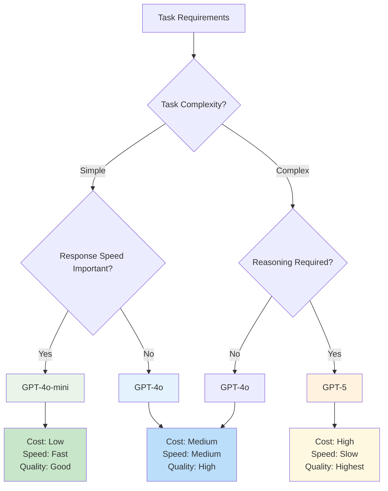
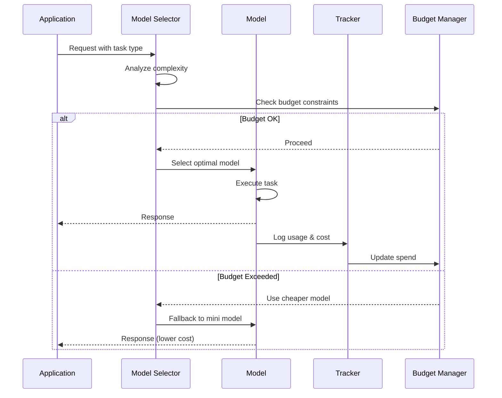

# Model Configuration - OpenAI Agents JS SDK

Complete guide to configuring models, providers, and optimizing model behavior within the SDK.

## Overview

The SDK provides flexible model configuration through two key interfaces:
- **Model**: Handles individual API requests
- **ModelProvider**: Resolves model names to specific Model instances

## Model Selection Decision Tree



## Available Models

### GPT-4 Family

```typescript
// GPT-4o - Recommended default
const agent = new Agent({
  name: 'Assistant',
  instructions: 'Be helpful',
  model: 'gpt-4o'
});

// GPT-4o-mini - Faster, more cost-effective
const fastAgent = new Agent({
  name: 'Fast Assistant',
  instructions: 'Provide quick responses',
  model: 'gpt-4o-mini'
});
```

### GPT-5 Family

```typescript
// GPT-5 with advanced reasoning
const reasoningAgent = new Agent({
  name: 'Reasoning Specialist',
  instructions: 'Think step by step and provide detailed analysis',
  model: 'gpt-5',
  modelSettings: {
    reasoning: {
      effort: 'high' // 'low', 'medium', 'high'
    }
  }
});
```

### Realtime Models

```typescript
import { RealtimeAgent } from '@openai/agents/realtime';

const voiceAgent = new RealtimeAgent({
  name: 'Voice Assistant',
  instructions: 'Respond naturally in conversation',
  model: 'gpt-4o-realtime-preview'
});
```

## Model Settings Configuration

### Basic Settings

```typescript
const agent = new Agent({
  name: 'Configured Agent',
  instructions: 'Be helpful and accurate',
  model: 'gpt-4o',
  modelSettings: {
    // Creativity control (0.0 - 1.0)
    temperature: 0.7,

    // Nucleus sampling (0.0 - 1.0)
    topP: 0.9,

    // Maximum response length
    maxTokens: 1000,

    // Tool usage strategy
    toolChoice: 'auto', // 'auto', 'none', or specific tool name

    // Stop sequences
    stop: ['\n\n', '###'],

    // Frequency penalty (-2.0 to 2.0)
    frequencyPenalty: 0.0,

    // Presence penalty (-2.0 to 2.0)
    presencePenalty: 0.0
  }
});
```

### GPT-5 Specific Settings

```typescript
const gpt5Agent = new Agent({
  name: 'GPT-5 Agent',
  instructions: 'Provide detailed, thoughtful responses',
  model: 'gpt-5',
  modelSettings: {
    // Reasoning configuration
    reasoning: {
      effort: 'medium' // 'low', 'medium', 'high'
    },

    // Response verbosity
    text: {
      verbosity: 'normal' // 'concise', 'normal', 'verbose'
    },

    // Standard parameters
    temperature: 0.3, // Lower for more deterministic reasoning
    maxTokens: 2000
  }
});
```

### Task-Specific Configurations

```typescript
// Creative writing
const creativeAgent = new Agent({
  name: 'Creative Writer',
  instructions: 'Write engaging, creative content',
  model: 'gpt-4o',
  modelSettings: {
    temperature: 0.9,      // High creativity
    topP: 0.95,           // Allow diverse vocabulary
    presencePenalty: 0.3,  // Encourage topic variety
    frequencyPenalty: 0.3  // Reduce repetition
  }
});

// Technical analysis
const technicalAgent = new Agent({
  name: 'Technical Analyst',
  instructions: 'Provide precise technical analysis',
  model: 'gpt-4o',
  modelSettings: {
    temperature: 0.2,      // Low creativity for precision
    topP: 0.8,            // More focused responses
    maxTokens: 1500
  }
});

// Code generation
const codeAgent = new Agent({
  name: 'Code Assistant',
  instructions: 'Generate clean, efficient code',
  model: 'gpt-4o',
  modelSettings: {
    temperature: 0.1,      // Very low for deterministic code
    stop: ['```\n\n'],     // Stop at code block end
    maxTokens: 2000
  }
});
```

## Model Provider Configuration

### Default Provider Setup

```typescript
import { setDefaultOpenAIKey, setDefaultModel } from '@openai/agents';

// Set global defaults
setDefaultOpenAIKey(process.env.OPENAI_API_KEY!);
setDefaultModel('gpt-4o');

// Environment-specific configuration
if (process.env.NODE_ENV === 'production') {
  setDefaultModel('gpt-4o');
} else {
  setDefaultModel('gpt-4o-mini'); // Cheaper for development
}
```

### Custom Model Provider

```typescript
import { ModelProvider, Model } from '@openai/agents';

class CustomModelProvider implements ModelProvider {
  private apiKey: string;
  private baseURL: string;

  constructor(apiKey: string, baseURL: string = 'https://api.openai.com/v1') {
    this.apiKey = apiKey;
    this.baseURL = baseURL;
  }

  resolveModel(modelName: string): Model {
    switch (modelName) {
      case 'gpt-4o':
        return new OpenAIModel({
          name: 'gpt-4o',
          apiKey: this.apiKey,
          baseURL: this.baseURL,
          defaultSettings: {
            temperature: 0.7,
            maxTokens: 1000
          }
        });

      case 'gpt-4o-mini':
        return new OpenAIModel({
          name: 'gpt-4o-mini',
          apiKey: this.apiKey,
          baseURL: this.baseURL,
          defaultSettings: {
            temperature: 0.5,
            maxTokens: 500
          }
        });

      default:
        throw new Error(`Unsupported model: ${modelName}`);
    }
  }
}

// Use custom provider
const customProvider = new CustomModelProvider(process.env.OPENAI_API_KEY!);
const runner = new Runner({ modelProvider: customProvider });
```

### Multi-Provider Setup

```typescript
class MultiProviderManager {
  private providers = new Map<string, ModelProvider>();

  constructor() {
    // OpenAI provider
    this.providers.set('openai', new OpenAIModelProvider({
      apiKey: process.env.OPENAI_API_KEY!
    }));

    // Azure OpenAI provider
    this.providers.set('azure', new AzureModelProvider({
      apiKey: process.env.AZURE_OPENAI_API_KEY!,
      endpoint: process.env.AZURE_OPENAI_ENDPOINT!,
      deploymentName: 'gpt-4o-deployment'
    }));
  }

  getModel(modelName: string, provider: string = 'openai'): Model {
    const modelProvider = this.providers.get(provider);
    if (!modelProvider) {
      throw new Error(`Provider not found: ${provider}`);
    }

    return modelProvider.resolveModel(modelName);
  }

  // Automatic failover
  async getModelWithFailover(modelName: string, primaryProvider: string = 'openai'): Promise<Model> {
    const providers = Array.from(this.providers.keys());
    const orderedProviders = [primaryProvider, ...providers.filter(p => p !== primaryProvider)];

    for (const provider of orderedProviders) {
      try {
        const model = this.getModel(modelName, provider);
        await this.testModel(model); // Quick health check
        return model;
      } catch (error) {
        console.warn(`Provider ${provider} failed, trying next:`, error.message);
      }
    }

    throw new Error(`All providers failed for model: ${modelName}`);
  }

  private async testModel(model: Model): Promise<void> {
    // Quick test to verify model availability
    // Implementation depends on your model interface
  }
}
```

## Performance Optimization

### Token Usage Optimization

```typescript
class TokenOptimizedAgent {
  private tokenLimits = {
    'gpt-4o': { input: 128000, output: 4096 },
    'gpt-4o-mini': { input: 128000, output: 16384 },
    'gpt-5': { input: 128000, output: 8192 }
  };

  createAgent(name: string, instructions: string, model: string = 'gpt-4o') {
    const limits = this.tokenLimits[model];

    // Optimize instructions length
    const optimizedInstructions = this.optimizeInstructions(instructions, limits.input);

    return new Agent({
      name,
      instructions: optimizedInstructions,
      model,
      modelSettings: {
        maxTokens: Math.min(limits.output, 1000), // Conservative limit
        temperature: 0.3 // Lower temperature for more predictable token usage
      }
    });
  }

  private optimizeInstructions(instructions: string, maxTokens: number): string {
    // Rough token estimation (1 token ≈ 4 characters)
    const estimatedTokens = instructions.length / 4;

    if (estimatedTokens > maxTokens * 0.1) { // Use max 10% of context for instructions
      // Truncate or summarize instructions
      return this.summarizeInstructions(instructions);
    }

    return instructions;
  }

  private summarizeInstructions(instructions: string): string {
    // Extract key points and create concise version
    const keyPoints = instructions
      .split('\n')
      .filter(line => line.trim().length > 0)
      .slice(0, 10) // Take first 10 lines
      .join('\n');

    return keyPoints;
  }
}
```

### Batch Processing

```typescript
class BatchModelProcessor {
  private batchSize = 5;
  private concurrentLimit = 3;

  async processBatch(requests: AgentRequest[]): Promise<AgentResponse[]> {
    const batches = this.createBatches(requests, this.batchSize);
    const results: AgentResponse[] = [];

    // Process batches with concurrency limit
    for (let i = 0; i < batches.length; i += this.concurrentLimit) {
      const currentBatches = batches.slice(i, i + this.concurrentLimit);

      const batchPromises = currentBatches.map(batch =>
        this.processSingleBatch(batch)
      );

      const batchResults = await Promise.allSettled(batchPromises);

      for (const result of batchResults) {
        if (result.status === 'fulfilled') {
          results.push(...result.value);
        } else {
          console.error('Batch processing failed:', result.reason);
        }
      }
    }

    return results;
  }

  private async processSingleBatch(requests: AgentRequest[]): Promise<AgentResponse[]> {
    const agent = new Agent({
      name: 'Batch Processor',
      instructions: 'Process multiple requests efficiently',
      model: 'gpt-4o-mini', // Use cheaper model for batch processing
      modelSettings: {
        temperature: 0.3,
        maxTokens: 500 // Limit response length
      }
    });

    const combinedInput = requests.map((req, idx) =>
      `Request ${idx + 1}: ${req.input}`
    ).join('\n\n');

    const result = await run(agent, `
      Process these requests separately:

      ${combinedInput}

      Respond with numbered answers for each request.
    `);

    return this.parseMultipleResponses(result.finalOutput, requests.length);
  }

  private createBatches<T>(items: T[], batchSize: number): T[][] {
    const batches: T[][] = [];
    for (let i = 0; i < items.length; i += batchSize) {
      batches.push(items.slice(i, i + batchSize));
    }
    return batches;
  }

  private parseMultipleResponses(response: string, expectedCount: number): AgentResponse[] {
    // Parse numbered responses
    const responses: AgentResponse[] = [];
    const lines = response.split('\n');

    let currentResponse = '';
    let responseIndex = 0;

    for (const line of lines) {
      if (/^\d+\./.test(line.trim())) {
        // New numbered response
        if (currentResponse && responseIndex > 0) {
          responses.push({
            index: responseIndex - 1,
            content: currentResponse.trim()
          });
        }
        currentResponse = line;
        responseIndex++;
      } else {
        currentResponse += '\n' + line;
      }
    }

    // Add final response
    if (currentResponse && responseIndex > 0) {
      responses.push({
        index: responseIndex - 1,
        content: currentResponse.trim()
      });
    }

    return responses;
  }
}
```

## Cost Optimization

### Model Selection Strategy

```typescript
class CostOptimizedModelSelector {
  private modelCosts = {
    'gpt-4o': { input: 0.005, output: 0.015 },      // per 1K tokens
    'gpt-4o-mini': { input: 0.00015, output: 0.0006 },
    'gpt-5': { input: 0.01, output: 0.03 }
  };

  selectOptimalModel(request: AgentRequest): string {
    const complexity = this.analyzeComplexity(request);
    const estimatedTokens = this.estimateTokenUsage(request);

    // Simple requests -> use mini model
    if (complexity.score < 0.3 && estimatedTokens.total < 1000) {
      return 'gpt-4o-mini';
    }

    // Complex reasoning -> use GPT-5
    if (complexity.requiresReasoning || complexity.score > 0.8) {
      return 'gpt-5';
    }

    // Default to GPT-4o
    return 'gpt-4o';
  }

  calculateCost(modelName: string, tokenUsage: { input: number; output: number }): number {
    const costs = this.modelCosts[modelName];
    if (!costs) return 0;

    return (tokenUsage.input * costs.input + tokenUsage.output * costs.output) / 1000;
  }

  private analyzeComplexity(request: AgentRequest): ComplexityAnalysis {
    const text = request.input.toLowerCase();

    // Keywords that indicate complexity
    const reasoningKeywords = ['analyze', 'compare', 'evaluate', 'explain why', 'reasoning'];
    const mathKeywords = ['calculate', 'equation', 'formula', 'solve'];
    const codeKeywords = ['function', 'algorithm', 'code', 'programming'];

    const reasoningScore = reasoningKeywords.filter(k => text.includes(k)).length / reasoningKeywords.length;
    const mathScore = mathKeywords.filter(k => text.includes(k)).length / mathKeywords.length;
    const codeScore = codeKeywords.filter(k => text.includes(k)).length / codeKeywords.length;

    const overallScore = Math.max(reasoningScore, mathScore, codeScore);

    return {
      score: overallScore,
      requiresReasoning: reasoningScore > 0.2,
      requiresMath: mathScore > 0.2,
      requiresCode: codeScore > 0.2
    };
  }

  private estimateTokenUsage(request: AgentRequest): { input: number; output: number; total: number } {
    // Rough estimation: 1 token ≈ 4 characters
    const inputTokens = Math.ceil(request.input.length / 4);
    const estimatedOutputTokens = Math.min(inputTokens * 0.5, 1000); // Estimate 50% of input length

    return {
      input: inputTokens,
      output: estimatedOutputTokens,
      total: inputTokens + estimatedOutputTokens
    };
  }
}
```

### Budget Management

```typescript
class BudgetManager {
  private monthlyBudget: number;
  private currentSpend: number = 0;
  private spendByModel = new Map<string, number>();

  constructor(monthlyBudget: number) {
    this.monthlyBudget = monthlyBudget;
    this.loadCurrentSpend();
  }

  async checkBudgetBefore(modelName: string, estimatedCost: number): Promise<boolean> {
    const projectedSpend = this.currentSpend + estimatedCost;

    // Check overall budget
    if (projectedSpend > this.monthlyBudget) {
      console.warn(`Request would exceed monthly budget: $${projectedSpend} > $${this.monthlyBudget}`);
      return false;
    }

    // Check model-specific limits
    const modelLimit = this.getModelLimit(modelName);
    const modelSpend = this.spendByModel.get(modelName) || 0;

    if (modelSpend + estimatedCost > modelLimit) {
      console.warn(`Request would exceed model budget for ${modelName}`);
      return false;
    }

    return true;
  }

  recordSpend(modelName: string, actualCost: number) {
    this.currentSpend += actualCost;

    const modelSpend = this.spendByModel.get(modelName) || 0;
    this.spendByModel.set(modelName, modelSpend + actualCost);

    this.saveCurrentSpend();
  }

  getBudgetStatus(): BudgetStatus {
    const remainingBudget = this.monthlyBudget - this.currentSpend;
    const utilizationPercent = (this.currentSpend / this.monthlyBudget) * 100;

    return {
      totalBudget: this.monthlyBudget,
      currentSpend: this.currentSpend,
      remainingBudget,
      utilizationPercent,
      spendByModel: Object.fromEntries(this.spendByModel),
      status: this.getBudgetAlertLevel(utilizationPercent)
    };
  }

  private getModelLimit(modelName: string): number {
    // Allocate budget by model based on usage patterns
    const allocations = {
      'gpt-4o': 0.6,       // 60% of budget
      'gpt-4o-mini': 0.2,  // 20% of budget
      'gpt-5': 0.2         // 20% of budget
    };

    const allocation = allocations[modelName] || 0.1;
    return this.monthlyBudget * allocation;
  }

  private getBudgetAlertLevel(utilizationPercent: number): 'healthy' | 'warning' | 'critical' {
    if (utilizationPercent >= 90) return 'critical';
    if (utilizationPercent >= 75) return 'warning';
    return 'healthy';
  }

  private loadCurrentSpend() {
    // Load from persistent storage (database, file, etc.)
    // Implementation depends on your storage solution
  }

  private saveCurrentSpend() {
    // Save to persistent storage
    // Implementation depends on your storage solution
  }
}
```

## Monitoring and Analytics

### Model Performance Tracking

```typescript
class ModelPerformanceTracker {
  private metrics = new Map<string, ModelMetrics>();

  recordModelUsage(modelName: string, usage: ModelUsage) {
    const existing = this.metrics.get(modelName) || this.createEmptyMetrics();

    existing.totalRequests++;
    existing.totalTokens.input += usage.tokens.input;
    existing.totalTokens.output += usage.tokens.output;
    existing.totalCost += usage.cost;
    existing.responseTimes.push(usage.responseTime);

    if (usage.success) {
      existing.successCount++;
    } else {
      existing.errorCount++;
      existing.errors.push({
        timestamp: Date.now(),
        error: usage.error
      });
    }

    this.metrics.set(modelName, existing);
  }

  getModelAnalytics(modelName: string): ModelAnalytics {
    const metrics = this.metrics.get(modelName);
    if (!metrics) {
      throw new Error(`No metrics found for model: ${modelName}`);
    }

    const avgResponseTime = metrics.responseTimes.reduce((a, b) => a + b, 0) / metrics.responseTimes.length;
    const successRate = metrics.successCount / metrics.totalRequests;
    const avgCostPerRequest = metrics.totalCost / metrics.totalRequests;

    return {
      model: modelName,
      totalRequests: metrics.totalRequests,
      successRate,
      avgResponseTime,
      totalTokens: metrics.totalTokens,
      avgTokensPerRequest: {
        input: metrics.totalTokens.input / metrics.totalRequests,
        output: metrics.totalTokens.output / metrics.totalRequests
      },
      totalCost: metrics.totalCost,
      avgCostPerRequest,
      recentErrors: metrics.errors.slice(-10) // Last 10 errors
    };
  }

  compareModels(models: string[]): ModelComparison {
    const analytics = models.map(model => ({
      model,
      ...this.getModelAnalytics(model)
    }));

    return {
      models: analytics,
      recommendations: this.generateRecommendations(analytics)
    };
  }

  private generateRecommendations(analytics: ModelAnalytics[]): string[] {
    const recommendations: string[] = [];

    // Find most cost-effective model
    const costEffective = analytics.reduce((prev, current) =>
      prev.avgCostPerRequest < current.avgCostPerRequest ? prev : current
    );

    recommendations.push(`Most cost-effective: ${costEffective.model} at $${costEffective.avgCostPerRequest.toFixed(4)} per request`);

    // Find fastest model
    const fastest = analytics.reduce((prev, current) =>
      prev.avgResponseTime < current.avgResponseTime ? prev : current
    );

    recommendations.push(`Fastest response: ${fastest.model} at ${fastest.avgResponseTime.toFixed(0)}ms average`);

    // Find most reliable model
    const mostReliable = analytics.reduce((prev, current) =>
      prev.successRate > current.successRate ? prev : current
    );

    recommendations.push(`Most reliable: ${mostReliable.model} with ${(mostReliable.successRate * 100).toFixed(1)}% success rate`);

    return recommendations;
  }

  private createEmptyMetrics(): ModelMetrics {
    return {
      totalRequests: 0,
      successCount: 0,
      errorCount: 0,
      totalTokens: { input: 0, output: 0 },
      totalCost: 0,
      responseTimes: [],
      errors: []
    };
  }
}
```

## Model Performance Flow



## References

### Official Documentation
- 📚 [Models Guide](https://openai.github.io/openai-agents-js/guides/models)
- ⚙️ [Configuration](https://openai.github.io/openai-agents-js/guides/configuration)
- 📊 [API Reference](https://openai.github.io/openai-agents-js/api)

### Related Guides
- 🎯 [Agent Configuration](https://openai.github.io/openai-agents-js/guides/agents)
- 📈 [Performance Optimization](https://openai.github.io/openai-agents-js/guides/tracing)

This comprehensive model configuration guide provides the foundation for optimizing performance, managing costs, and monitoring model usage in production environments.