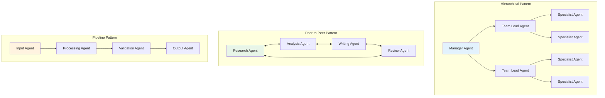
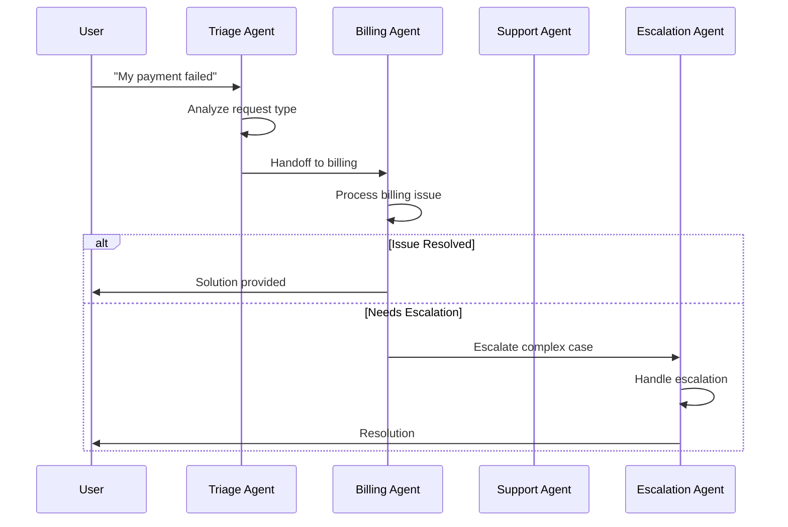
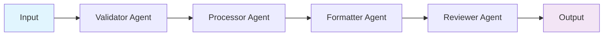
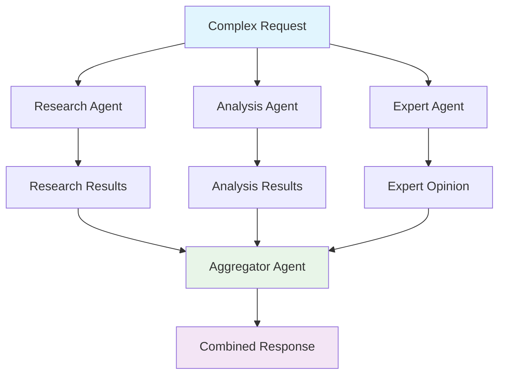
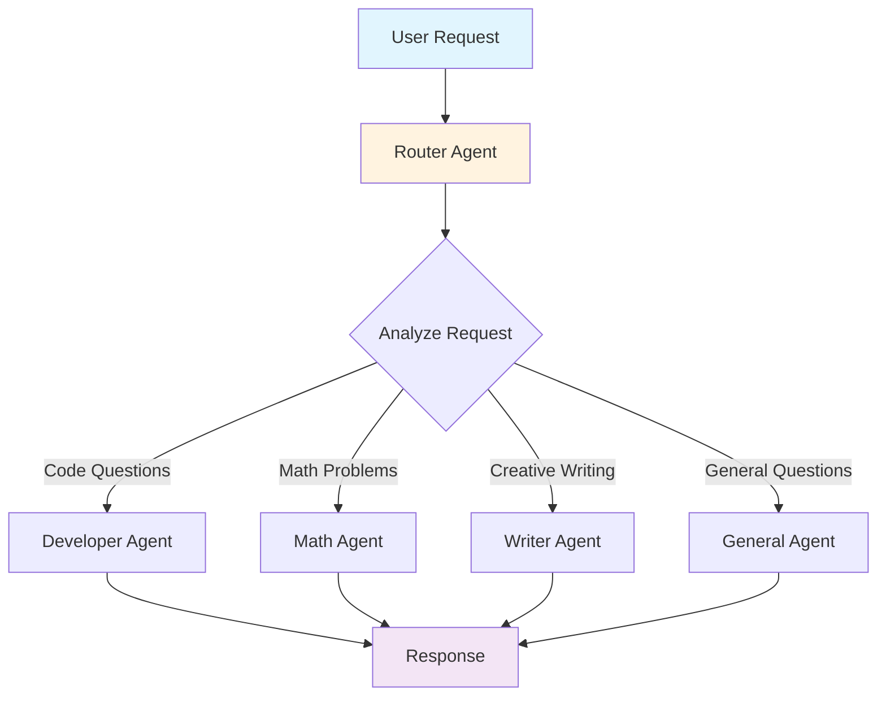
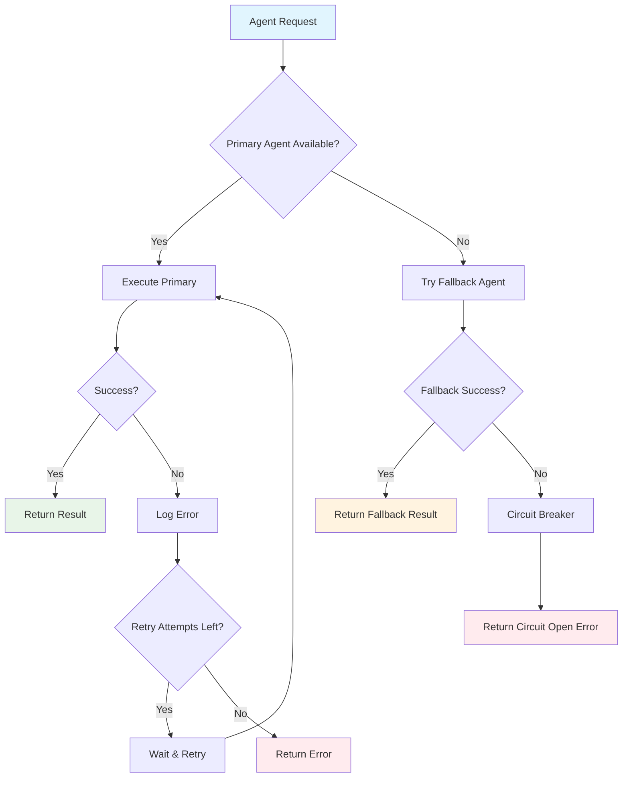

# Multi-Agent Patterns - OpenAI Agents JS SDK

Comprehensive guide to designing and implementing multi-agent systems using handoffs and agent coordination patterns.

> **Official Guide**: [https://openai.github.io/openai-agents-js/guides/handoffs](https://openai.github.io/openai-agents-js/guides/handoffs)

## Overview

Multi-agent systems enable complex problem-solving by coordinating specialized agents. The SDK provides two primary mechanisms:

1. **Handoffs**: Agent-to-agent delegation with conversation transfer
2. **Agent Tools**: Using agents as tools within other agents

## Multi-Agent Architecture Patterns



## Handoff Patterns

### Basic Handoff Setup

```typescript
import { Agent, handoff } from '@openai/agents';

const billingAgent = new Agent({
  name: 'Billing Specialist',
  instructions: `
    You handle billing inquiries, payment issues, and account questions.
    You have access to billing systems and can process refunds.
  `,
  tools: [billingSystemTool, refundTool]
});

const technicalAgent = new Agent({
  name: 'Technical Support',
  instructions: `
    You resolve technical issues, troubleshoot problems, and guide users.
    You can access diagnostic tools and escalate complex issues.
  `,
  tools: [diagnosticTool, logAnalysisTool]
});

const triageAgent = new Agent({
  name: 'Customer Service Triage',
  instructions: `
    You are the first point of contact for customers.
    Listen to their issue and route them to the appropriate specialist:
    - Billing issues → billing specialist
    - Technical problems → technical support
    - General questions → handle yourself
  `,
  handoffs: [billingAgent, technicalAgent]
});
```

### Advanced Handoff Configuration

```typescript
import { z } from 'zod';

const EscalationInput = z.object({
  reason: z.string().describe('Reason for escalation'),
  priority: z.enum(['low', 'medium', 'high', 'urgent']),
  customerInfo: z.object({
    userId: z.string(),
    tier: z.enum(['basic', 'premium', 'enterprise'])
  }),
  previousAttempts: z.number().default(0)
});

const escalationAgent = new Agent({
  name: 'Senior Support Specialist',
  instructions: `
    Handle escalated customer issues that couldn't be resolved by front-line support.
    You have elevated permissions and access to senior staff.
  `,
  tools: [adminTool, seniorStaffTool, customerHistoryTool]
});

const supportAgent = new Agent({
  name: 'Front-line Support',
  instructions: 'Provide customer support and escalate when necessary',
  handoffs: [
    handoff(escalationAgent, {
      inputType: EscalationInput,

      // Custom handoff logic
      onHandoff: async (context, input) => {
        // Log escalation
        await logEscalation({
          fromAgent: context.currentAgent.name,
          toAgent: escalationAgent.name,
          reason: input.reason,
          priority: input.priority,
          timestamp: new Date()
        });

        // Send notifications for urgent cases
        if (input.priority === 'urgent') {
          await notifySeniorStaff(input);
        }

        // Update customer record
        await updateCustomerRecord(input.customerInfo.userId, {
          escalated: true,
          escalationReason: input.reason
        });
      },

      // Filter conversation history
      contextFilter: (history) => {
        // Only pass relevant conversation parts
        return history.filter(item =>
          !item.content.includes('internal-note:')
        );
      }
    })
  ]
});
```

## Multi-Agent Orchestration Patterns

### Hierarchical Agent Structure

```typescript
// Leaf agents - specialized workers
const dataAnalysisAgent = new Agent({
  name: 'Data Analyst',
  instructions: 'Analyze data and provide insights',
  tools: [sqlTool, statisticsTool, visualizationTool]
});

const reportGeneratorAgent = new Agent({
  name: 'Report Generator',
  instructions: 'Create comprehensive reports from analysis',
  tools: [templateTool, chartTool, exportTool]
});

const dataValidatorAgent = new Agent({
  name: 'Data Validator',
  instructions: 'Validate data quality and accuracy',
  tools: [validationTool, cleaningTool, auditTool]
});

// Mid-level coordinator
const dataWorkflowAgent = new Agent({
  name: 'Data Workflow Coordinator',
  instructions: `
    Coordinate data processing workflows:
    1. Validate data quality first
    2. Perform analysis if data is valid
    3. Generate reports from analysis results
  `,
  tools: [
    dataValidatorAgent.asTool(),
    dataAnalysisAgent.asTool(),
    reportGeneratorAgent.asTool()
  ]
});

// Top-level orchestrator
const businessIntelligenceAgent = new Agent({
  name: 'Business Intelligence Manager',
  instructions: 'Manage BI requests and coordinate data workflows',
  tools: [
    dataWorkflowAgent.asTool(),
    emailTool,
    schedulingTool
  ]
});
```

### Peer-to-Peer Agent Collaboration

```typescript
const researchAgent = new Agent({
  name: 'Research Specialist',
  instructions: 'Conduct thorough research on topics',
  tools: [webSearchTool, academicSearchTool, factCheckTool]
});

const writingAgent = new Agent({
  name: 'Content Writer',
  instructions: 'Create well-written content based on research',
  tools: [grammarTool, styleCheckerTool, plagiarismTool]
});

const editorAgent = new Agent({
  name: 'Editor',
  instructions: 'Review and improve written content',
  tools: [editingTool, proofreadingTool, formatTool]
});

// Each agent can collaborate with others
const collaborativeWritingAgent = new Agent({
  name: 'Collaborative Writing Coordinator',
  instructions: `
    Coordinate content creation workflow:
    1. Research the topic thoroughly
    2. Write initial draft based on research
    3. Edit and refine the content
    4. Iterate until quality standards are met
  `,
  handoffs: [researchAgent, writingAgent, editorAgent]
});
```

### State Management Across Agents

```typescript
interface ProjectState {
  projectId: string;
  phase: 'planning' | 'execution' | 'review' | 'completion';
  artifacts: {
    requirements?: string;
    design?: string;
    implementation?: string;
    tests?: string;
  };
  metrics: {
    progress: number;
    quality: number;
    timeline: string;
  };
}

const requirementsAgent = new Agent({
  name: 'Requirements Analyst',
  instructions: 'Analyze and document project requirements',
  context: async (input, history) => {
    const projectState = await getProjectState(input.projectId);
    return { projectState, phase: 'planning' };
  }
});

const designAgent = new Agent({
  name: 'System Designer',
  instructions: 'Create system design based on requirements',
  context: async (input, history) => {
    const projectState = await getProjectState(input.projectId);
    return {
      projectState,
      requirements: projectState.artifacts.requirements
    };
  }
});

const projectManagerAgent = new Agent({
  name: 'Project Manager',
  instructions: 'Orchestrate project workflow and track progress',
  handoffs: [requirementsAgent, designAgent],
  tools: [
    tool({
      name: 'update_project_state',
      description: 'Update project state and artifacts',
      parameters: z.object({
        projectId: z.string(),
        updates: z.record(z.any())
      }),
      async execute({ projectId, updates }) {
        await updateProjectState(projectId, updates);
        return 'Project state updated';
      }
    })
  ]
});
```

## Conversation Flow Patterns

## Handoff Flow Diagram



## Conversation Flow Patterns

### Sequential Processing



```typescript
const sequentialWorkflowAgent = new Agent({
  name: 'Sequential Processor',
  instructions: `
    Process requests through a sequential pipeline:
    1. Input validation → validator agent
    2. Data processing → processor agent
    3. Output formatting → formatter agent
    4. Quality check → reviewer agent
  `,
  handoffs: [validatorAgent, processorAgent, formatterAgent, reviewerAgent]
});
```

### Parallel Processing with Aggregation



```typescript
const parallelProcessorAgent = new Agent({
  name: 'Parallel Processor',
  instructions: `
    Process complex requests using multiple specialists in parallel:
    - Use research agent for background information
    - Use analysis agent for data analysis
    - Use expert agent for domain expertise
    - Combine results into comprehensive response
  `,
  tools: [
    researchAgent.asTool(),
    analysisAgent.asTool(),
    expertAgent.asTool(),
    tool({
      name: 'combine_results',
      description: 'Combine results from multiple agents',
      parameters: z.object({
        research: z.string(),
        analysis: z.string(),
        expert: z.string()
      }),
      async execute({ research, analysis, expert }) {
        return `
**Research Findings:**
${research}

**Data Analysis:**
${analysis}

**Expert Opinion:**
${expert}

**Conclusion:**
Based on the combined insights above...
        `;
      }
    })
  ]
});
```

### Conditional Routing



```typescript
const routingAgent = new Agent({
  name: 'Smart Router',
  instructions: `
    Route requests based on content analysis:
    - Code questions → developer agent
    - Math problems → math agent
    - Creative writing → writer agent
    - General questions → handle yourself
  `,
  tools: [
    tool({
      name: 'analyze_request_type',
      description: 'Analyze request to determine appropriate routing',
      parameters: z.object({
        request: z.string()
      }),
      async execute({ request }) {
        const keywords = request.toLowerCase();

        if (keywords.includes('code') || keywords.includes('programming')) {
          return { type: 'code', confidence: 0.9 };
        }
        if (keywords.includes('math') || keywords.includes('calculate')) {
          return { type: 'math', confidence: 0.8 };
        }
        if (keywords.includes('write') || keywords.includes('story')) {
          return { type: 'creative', confidence: 0.7 };
        }

        return { type: 'general', confidence: 0.5 };
      }
    }),
    developerAgent.asTool(),
    mathAgent.asTool(),
    writerAgent.asTool()
  ]
});
```

## Error Handling and Recovery

### Agent Failure Recovery

```typescript
const resilientWorkflowAgent = new Agent({
  name: 'Resilient Workflow Manager',
  instructions: 'Manage workflows with automatic error recovery',
  tools: [
    tool({
      name: 'safe_agent_call',
      description: 'Call agent with error handling and fallbacks',
      parameters: z.object({
        agentName: z.string(),
        request: z.string(),
        fallbackAgent: z.string().optional()
      }),
      async execute({ agentName, request, fallbackAgent }) {
        try {
          const primaryAgent = getAgent(agentName);
          const result = await run(primaryAgent, request);
          return {
            success: true,
            agent: agentName,
            result: result.finalOutput
          };
        } catch (error) {
          console.error(`Primary agent ${agentName} failed:`, error.message);

          if (fallbackAgent) {
            try {
              const backupAgent = getAgent(fallbackAgent);
              const fallbackResult = await run(backupAgent, request);
              return {
                success: true,
                agent: fallbackAgent,
                result: fallbackResult.finalOutput,
                fallback: true,
                originalError: error.message
              };
            } catch (fallbackError) {
              return {
                success: false,
                error: `Both primary (${agentName}) and fallback (${fallbackAgent}) agents failed`,
                primaryError: error.message,
                fallbackError: fallbackError.message
              };
            }
          }

          return {
            success: false,
            agent: agentName,
            error: error.message
          };
        }
      }
    })
  ]
});
```

### Circuit Breaker Pattern

```typescript
class AgentCircuitBreaker {
  private failures = new Map<string, number>();
  private lastFailure = new Map<string, number>();

  async callAgent(agent: Agent, input: string, threshold = 3, timeout = 60000) {
    const agentKey = agent.name;
    const now = Date.now();

    // Check if circuit is open
    const failureCount = this.failures.get(agentKey) || 0;
    const lastFail = this.lastFailure.get(agentKey) || 0;

    if (failureCount >= threshold && (now - lastFail) < timeout) {
      throw new Error(`Circuit breaker open for agent ${agentKey}`);
    }

    try {
      const result = await run(agent, input);

      // Reset on success
      this.failures.set(agentKey, 0);

      return result;
    } catch (error) {
      // Increment failure count
      this.failures.set(agentKey, failureCount + 1);
      this.lastFailure.set(agentKey, now);

      throw error;
    }
  }
}

const circuitBreaker = new AgentCircuitBreaker();

const protectedWorkflowAgent = new Agent({
  name: 'Protected Workflow',
  instructions: 'Use circuit breaker pattern for agent calls',
  tools: [
    tool({
      name: 'protected_agent_call',
      description: 'Call agent with circuit breaker protection',
      parameters: z.object({
        agentName: z.string(),
        request: z.string()
      }),
      async execute({ agentName, request }) {
        const agent = getAgent(agentName);
        return await circuitBreaker.callAgent(agent, request);
      }
    })
  ]
});
```

## Performance Optimization

### Agent Pool Management

```typescript
class AgentPool {
  private pools = new Map<string, Agent[]>();
  private inUse = new Set<Agent>();

  getAgent(type: string): Agent {
    const pool = this.pools.get(type) || [];
    const available = pool.find(agent => !this.inUse.has(agent));

    if (available) {
      this.inUse.add(available);
      return available;
    }

    // Create new agent if pool is empty
    const newAgent = this.createAgent(type);
    this.pools.set(type, [...pool, newAgent]);
    this.inUse.add(newAgent);

    return newAgent;
  }

  releaseAgent(agent: Agent) {
    this.inUse.delete(agent);
  }

  private createAgent(type: string): Agent {
    const configs = {
      'analyst': {
        name: 'Data Analyst',
        instructions: 'Analyze data and provide insights',
        tools: [analysisTool]
      },
      'writer': {
        name: 'Content Writer',
        instructions: 'Create written content',
        tools: [writingTool]
      }
    };

    return new Agent(configs[type]);
  }
}
```

## Best Practices

### 1. Agent Specialization
- Design agents with focused, specific roles
- Avoid creating overly general agents
- Use clear, descriptive names and instructions

### 2. Handoff Strategy
- Plan handoff points carefully
- Include necessary context in handoffs
- Validate handoff inputs with schemas

### 3. State Management
- Maintain state consistency across agents
- Use persistent storage for long-running workflows
- Implement state validation and recovery

### 4. Error Handling
- Implement comprehensive error handling
- Use fallback agents for critical workflows
- Log all agent interactions for debugging

### 5. Performance
- Pool agents to reduce initialization overhead
- Use circuit breakers for unreliable agents
- Monitor agent performance and costs

### 6. Security
- Validate all inter-agent communications
- Implement proper authorization between agents
- Sanitize data passed between agents

## Error Recovery Flow



## References

### Official Documentation
- 📚 [Handoffs Guide](https://openai.github.io/openai-agents-js/guides/handoffs)
- 🤝 [Multi-Agent Orchestration](https://openai.github.io/openai-agents-js/guides/multi-agent-orchestration)
- 🔧 [Agent Tools](https://openai.github.io/openai-agents-js/guides/tools#agents-as-tools)

### Related Guides
- 🛡️ [Context Management](https://openai.github.io/openai-agents-js/guides/context-management)
- 📊 [Tracing Multi-Agent Flows](https://openai.github.io/openai-agents-js/guides/tracing)

This multi-agent system design enables building sophisticated, resilient AI workflows that can handle complex, multi-step problems through intelligent agent coordination.