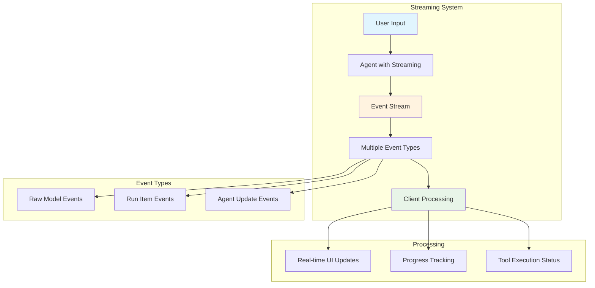
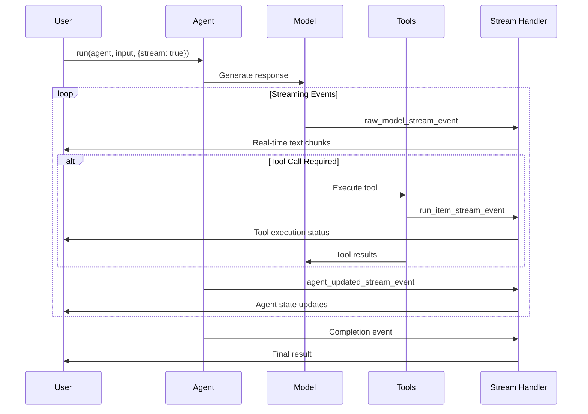
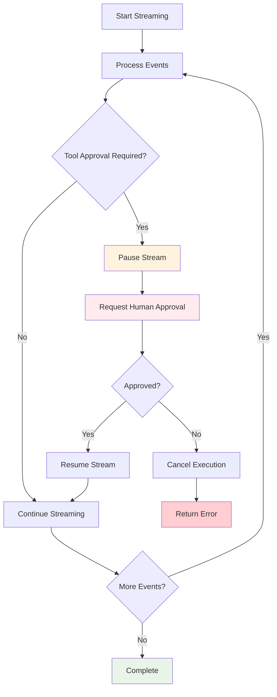
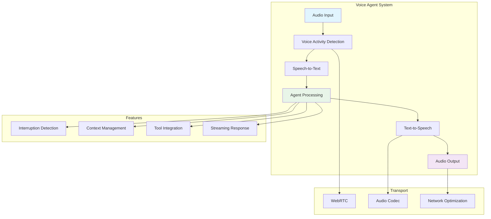
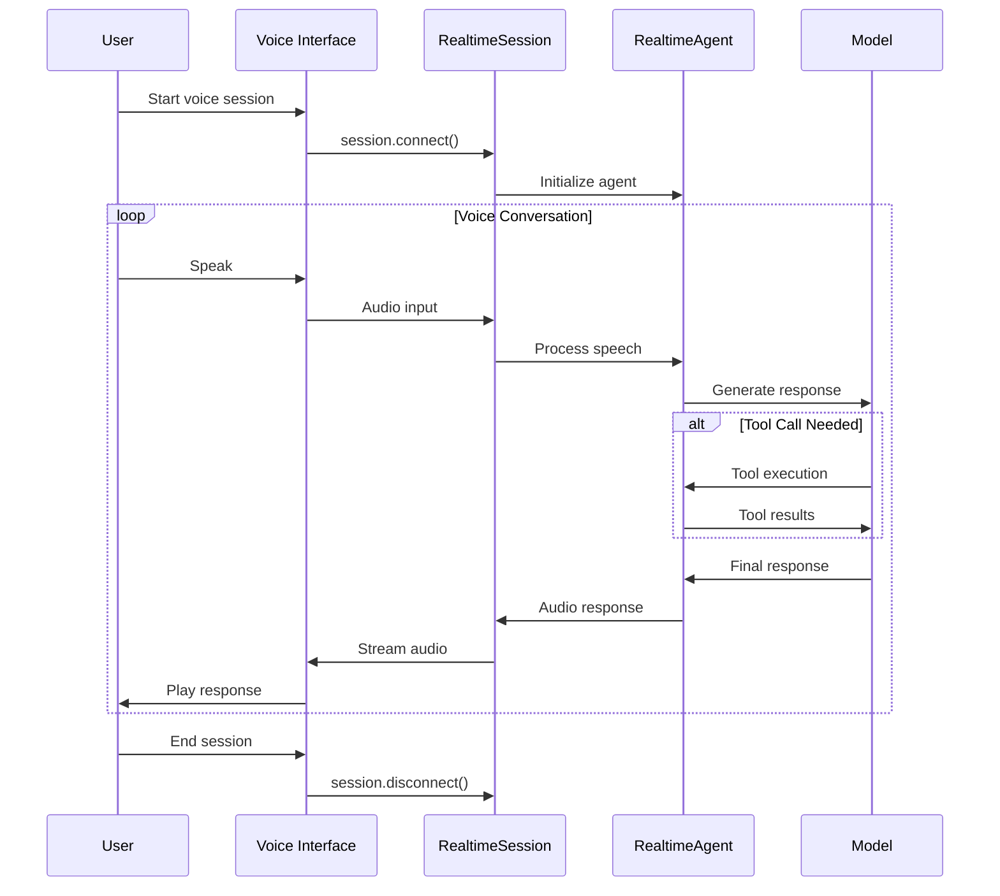

# Streaming & Realtime - OpenAI Agents JS SDK

Complete guide to implementing streaming responses and realtime voice interactions.

> **Official Guide**: [https://openai.github.io/openai-agents-js/guides/streaming](https://openai.github.io/openai-agents-js/guides/streaming)
> **Realtime Guide**: [https://openai.github.io/openai-agents-js/guides/realtime](https://openai.github.io/openai-agents-js/guides/realtime)

## Overview

The SDK provides two primary real-time capabilities:
1. **Streaming**: Real-time text and event streaming from text-based agents
2. **Realtime Voice**: Full-duplex voice conversations with interruption detection

## Streaming Architecture



## Text Streaming

### Basic Streaming Setup

```typescript
import { Agent, run } from '@openai/agents';

const agent = new Agent({
  name: 'Streaming Assistant',
  instructions: 'Provide helpful responses with real-time updates'
});

// Enable streaming
const result = await run(agent, 'Write a long story about space exploration', {
  stream: true
});

// Simple text streaming
result.toTextStream().pipe(process.stdout);

// Wait for completion
await result.completed;
console.log('\nFinal result:', result.finalOutput);
```

## Streaming Event Flow



### Advanced Event Streaming

```typescript
const streamingAgent = new Agent({
  name: 'Event Streaming Agent',
  instructions: 'Provide detailed responses with progress updates',
  tools: [longRunningTool, dataProcessingTool]
});

const result = await run(streamingAgent, 'Analyze this large dataset', {
  stream: true
});

// Handle different event types
for await (const event of result) {
  switch (event.type) {
    case 'raw_model_stream_event':
      // Raw model output chunks
      if (event.data.type === 'content.delta') {
        process.stdout.write(event.data.text);
      }
      break;

    case 'run_item_stream_event':
      // SDK-generated events
      if (event.data.type === 'tool_call_started') {
        console.log(`\n🔧 Starting tool: ${event.data.tool_name}`);
      }
      if (event.data.type === 'tool_call_completed') {
        console.log(`✅ Tool completed: ${event.data.tool_name}`);
      }
      break;

    case 'agent_updated_stream_event':
      // Agent state changes
      console.log(`📊 Agent update: ${event.data.message}`);
      break;
  }
}
```

### Custom Streaming Interface

```typescript
class StreamingInterface {
  private currentAgent: string = '';
  private toolProgress: Map<string, number> = new Map();

  async handleStreamingRun(agent: Agent, input: string) {
    const result = await run(agent, input, { stream: true });

    // Create UI elements
    this.createProgressUI();

    for await (const event of result) {
      await this.handleEvent(event);
    }

    await result.completed;
    this.showFinalResult(result.finalOutput);
  }

  private async handleEvent(event: any) {
    switch (event.type) {
      case 'raw_model_stream_event':
        this.updateTextOutput(event.data);
        break;

      case 'run_item_stream_event':
        if (event.data.type === 'tool_call_started') {
          this.startToolProgress(event.data.tool_name);
        }
        if (event.data.type === 'tool_call_completed') {
          this.completeToolProgress(event.data.tool_name);
        }
        break;

      case 'agent_updated_stream_event':
        this.updateAgentStatus(event.data);
        break;
    }
  }

  private createProgressUI() {
    console.log('┌─ Agent Execution Progress ─┐');
  }

  private updateTextOutput(data: any) {
    if (data.type === 'content.delta') {
      process.stdout.write(data.text || '');
    }
  }

  private startToolProgress(toolName: string) {
    console.log(`\n├─ 🔧 ${toolName}: Starting...`);
    this.toolProgress.set(toolName, 0);
  }

  private completeToolProgress(toolName: string) {
    console.log(`├─ ✅ ${toolName}: Completed`);
    this.toolProgress.set(toolName, 100);
  }

  private updateAgentStatus(data: any) {
    console.log(`├─ 📊 Status: ${data.message}`);
  }

  private showFinalResult(output: string) {
    console.log('\n└─ 🎯 Final Result:');
    console.log(output);
  }
}
```

## Human-in-the-Loop Streaming



```typescript
class InteractiveStreamingSession {
  private approvalQueue: Array<any> = [];

  async runInteractiveAgent(agent: Agent, input: string) {
    const result = await run(agent, input, { stream: true });

    // Handle streaming with interruptions
    for await (const event of result) {
      if (event.type === 'run_item_stream_event' &&
          event.data.type === 'tool_approval_required') {

        // Pause streaming for approval
        console.log('\n⏸️  Pausing for approval...');
        const approved = await this.requestApproval(event.data);

        if (approved) {
          result.state.approve();
          console.log('✅ Approved - resuming...');
        } else {
          result.state.reject();
          console.log('❌ Rejected - stopping...');
          break;
        }
      } else {
        await this.handleStreamEvent(event);
      }
    }

    // Continue execution after approval
    if (result.interruptions.length === 0) {
      await result.completed;
    }

    return result;
  }

  private async requestApproval(toolCall: any): Promise<boolean> {
    console.log(`\n🤔 Tool "${toolCall.tool_name}" requires approval:`);
    console.log(`   Parameters: ${JSON.stringify(toolCall.parameters, null, 2)}`);

    const readline = require('readline').createInterface({
      input: process.stdin,
      output: process.stdout
    });

    return new Promise(resolve => {
      readline.question('Approve this action? (y/n): ', (answer) => {
        readline.close();
        resolve(answer.toLowerCase() === 'y');
      });
    });
  }

  private async handleStreamEvent(event: any) {
    // Handle regular streaming events
    if (event.type === 'raw_model_stream_event' &&
        event.data.type === 'content.delta') {
      process.stdout.write(event.data.text || '');
    }
  }
}
```

## Realtime Voice Architecture



## Realtime Voice Agents

### Basic Voice Agent Setup

```typescript
import { RealtimeAgent, RealtimeSession } from '@openai/agents/realtime';

const voiceAgent = new RealtimeAgent({
  name: 'Voice Assistant',
  instructions: `
    You are a helpful voice assistant.
    - Speak naturally and conversationally
    - Keep responses concise for voice interaction
    - Ask clarifying questions when needed
  `,
  voice: 'alloy', // Voice model selection
  tools: [weatherTool, calendarTool]
});

// Create realtime session
const session = new RealtimeSession(voiceAgent);

// Connect to realtime API
await session.connect({
  apiKey: process.env.OPENAI_API_KEY
});

console.log('🎙️ Voice session started. Say something!');

// Handle session events
session.on('conversation.item.created', (event) => {
  console.log('New message:', event.item);
});

session.on('response.audio.delta', (event) => {
  // Stream audio to speakers
  audioOutput.write(event.delta);
});

session.on('input_audio_buffer.speech_started', () => {
  console.log('🗣️ User started speaking');
});

session.on('input_audio_buffer.speech_stopped', () => {
  console.log('🔇 User stopped speaking');
});
```

### Advanced Voice Agent Features

```typescript
const advancedVoiceAgent = new RealtimeAgent({
  name: 'Advanced Voice Assistant',
  instructions: `
    You are an advanced voice assistant with the following capabilities:
    - Natural conversation flow
    - Interruption handling
    - Context awareness
    - Multi-turn conversations
  `,
  voice: 'nova',
  model: 'gpt-4o-realtime-preview',

  // Voice-specific configuration
  voice_settings: {
    speed: 1.0,        // Speaking speed
    pitch: 0.0,        // Voice pitch adjustment
    volume: 0.8        // Output volume
  },

  // Audio processing settings
  audio_settings: {
    input_audio_transcription: {
      model: 'whisper-1'
    },
    turn_detection: {
      type: 'server_vad',      // Voice Activity Detection
      threshold: 0.5,
      prefix_padding_ms: 300,
      silence_duration_ms: 500
    }
  },

  tools: [
    voiceCalendarTool,
    voiceWeatherTool,
    voiceReminderTool
  ]
});
```

### Browser-Based Voice Implementation

```html
<!DOCTYPE html>
<html>
<head>
    <title>Voice Agent Web Interface</title>
</head>
<body>
    <div id="voice-interface">
        <button id="start-session">Start Voice Session</button>
        <button id="end-session" disabled>End Session</button>
        <div id="status">Ready</div>
        <div id="conversation"></div>
    </div>

    <script type="module">
        import { RealtimeAgent, RealtimeSession } from '@openai/agents/realtime';

        class VoiceInterface {
            constructor() {
                this.session = null;
                this.audioContext = null;
                this.microphone = null;
                this.speakers = null;

                this.setupUI();
            }

            async setupUI() {
                const startBtn = document.getElementById('start-session');
                const endBtn = document.getElementById('end-session');

                startBtn.onclick = () => this.startSession();
                endBtn.onclick = () => this.endSession();
            }

            async startSession() {
                try {
                    // Request microphone access
                    const stream = await navigator.mediaDevices.getUserMedia({
                        audio: {
                            sampleRate: 24000,
                            channelCount: 1,
                            echoCancellation: true,
                            noiseSuppression: true
                        }
                    });

                    // Setup audio context
                    this.audioContext = new AudioContext({ sampleRate: 24000 });
                    this.microphone = this.audioContext.createMediaStreamSource(stream);

                    // Create voice agent
                    const agent = new RealtimeAgent({
                        name: 'Web Voice Assistant',
                        instructions: 'You are a helpful web-based voice assistant',
                        voice: 'alloy'
                    });

                    // Create session with WebRTC transport
                    this.session = new RealtimeSession(agent);

                    // Connect with browser-specific options
                    await this.session.connect({
                        apiKey: process.env.OPENAI_API_KEY,
                        transport: 'webrtc',
                        audio: {
                            input: stream,
                            output: this.audioContext.destination
                        }
                    });

                    this.setupSessionHandlers();
                    this.updateStatus('Connected - listening...');

                    document.getElementById('start-session').disabled = true;
                    document.getElementById('end-session').disabled = false;

                } catch (error) {
                    console.error('Failed to start voice session:', error);
                    this.updateStatus(`Error: ${error.message}`);
                }
            }

            setupSessionHandlers() {
                this.session.on('conversation.item.created', (event) => {
                    this.addToConversation(event.item);
                });

                this.session.on('response.audio.delta', (event) => {
                    // Audio output is handled automatically by WebRTC
                });

                this.session.on('input_audio_buffer.speech_started', () => {
                    this.updateStatus('Listening...');
                });

                this.session.on('input_audio_buffer.speech_stopped', () => {
                    this.updateStatus('Processing...');
                });

                this.session.on('response.done', () => {
                    this.updateStatus('Response complete - listening...');
                });

                this.session.on('error', (error) => {
                    console.error('Session error:', error);
                    this.updateStatus(`Error: ${error.message}`);
                });
            }

            addToConversation(item) {
                const conversationDiv = document.getElementById('conversation');
                const itemDiv = document.createElement('div');
                itemDiv.className = `conversation-item ${item.role}`;

                if (item.type === 'message') {
                    itemDiv.innerHTML = `
                        <strong>${item.role}:</strong>
                        ${item.content[0]?.text || '[Audio Response]'}
                    `;
                }

                conversationDiv.appendChild(itemDiv);
                conversationDiv.scrollTop = conversationDiv.scrollHeight;
            }

            updateStatus(message) {
                document.getElementById('status').textContent = message;
            }

            async endSession() {
                if (this.session) {
                    await this.session.disconnect();
                    this.session = null;
                }

                if (this.audioContext) {
                    await this.audioContext.close();
                    this.audioContext = null;
                }

                this.updateStatus('Disconnected');
                document.getElementById('start-session').disabled = false;
                document.getElementById('end-session').disabled = true;
            }
        }

        // Initialize voice interface
        new VoiceInterface();
    </script>
</body>
</html>
```

### Voice Tool Integration

```typescript
const voiceCalendarTool = tool({
  name: 'schedule_meeting',
  description: 'Schedule a meeting in the user\'s calendar (voice-optimized)',
  parameters: z.object({
    title: z.string().describe('Meeting title'),
    date: z.string().describe('Meeting date (e.g., "tomorrow", "next Monday")'),
    time: z.string().describe('Meeting time (e.g., "2 PM", "14:00")'),
    duration: z.number().default(60).describe('Duration in minutes')
  }),
  async execute({ title, date, time, duration }) {
    const scheduledDate = parseNaturalDate(date, time);
    const meeting = await scheduleCalendarEvent({
      title,
      start: scheduledDate,
      duration
    });

    // Return voice-friendly response
    return `I've scheduled "${title}" for ${formatVoiceDate(scheduledDate)} lasting ${duration} minutes. The meeting ID is ${meeting.id}.`;
  }
});

const voiceWeatherTool = tool({
  name: 'get_weather_voice',
  description: 'Get weather information optimized for voice response',
  parameters: z.object({
    location: z.string().describe('City or location'),
    when: z.enum(['now', 'today', 'tomorrow', 'this_week']).default('now')
  }),
  async execute({ location, when }) {
    const weather = await getWeatherData(location, when);

    // Format for natural speech
    const temp = Math.round(weather.temperature);
    const condition = weather.condition.toLowerCase();

    if (when === 'now') {
      return `It's currently ${temp} degrees and ${condition} in ${location}.`;
    } else if (when === 'today') {
      return `Today in ${location}, expect a high of ${weather.high} and low of ${weather.low} with ${condition} conditions.`;
    }

    return formatWeatherForSpeech(weather, when, location);
  }
});
```

## Performance Optimization

### Streaming Buffer Management

```typescript
class StreamingBuffer {
  private buffer: string = '';
  private flushInterval: number = 50; // ms
  private lastFlush: number = 0;

  append(chunk: string) {
    this.buffer += chunk;
    this.maybeFlush();
  }

  private maybeFlush() {
    const now = Date.now();
    if (now - this.lastFlush > this.flushInterval) {
      this.flush();
    }
  }

  flush() {
    if (this.buffer.length > 0) {
      process.stdout.write(this.buffer);
      this.buffer = '';
      this.lastFlush = Date.now();
    }
  }

  complete() {
    this.flush();
  }
}
```

### Audio Quality Optimization

```typescript
const optimizedVoiceAgent = new RealtimeAgent({
  name: 'High Quality Voice Agent',
  instructions: 'Provide clear, concise responses optimized for voice',

  audio_settings: {
    // Optimize for clarity
    input_audio_transcription: {
      model: 'whisper-1'
    },

    // Fine-tune voice activity detection
    turn_detection: {
      type: 'server_vad',
      threshold: 0.6,           // Higher threshold for noise
      prefix_padding_ms: 200,   // Less padding for responsiveness
      silence_duration_ms: 400  // Shorter silence detection
    },

    // Audio quality settings
    output_audio_format: 'pcm16', // High quality format
    sample_rate: 24000            // Standard sample rate
  },

  // Response optimization for voice
  modelSettings: {
    temperature: 0.3,  // More deterministic for voice
    maxTokens: 150     // Shorter responses for voice
  }
});
```

## Error Handling

### Streaming Error Recovery

```typescript
async function resilientStreaming(agent: Agent, input: string) {
  let retries = 0;
  const maxRetries = 3;

  while (retries < maxRetries) {
    try {
      const result = await run(agent, input, { stream: true });

      for await (const event of result) {
        try {
          await handleStreamEvent(event);
        } catch (eventError) {
          console.warn('Event handling error:', eventError.message);
          // Continue processing other events
        }
      }

      await result.completed;
      return result;

    } catch (error) {
      retries++;
      console.error(`Streaming attempt ${retries} failed:`, error.message);

      if (retries < maxRetries) {
        const delay = Math.pow(2, retries - 1) * 1000; // Exponential backoff
        await new Promise(resolve => setTimeout(resolve, delay));
      } else {
        throw new Error(`Streaming failed after ${maxRetries} attempts: ${error.message}`);
      }
    }
  }
}
```

### Voice Session Error Handling

```typescript
class RobustVoiceSession {
  private session: RealtimeSession;
  private reconnectAttempts = 0;
  private maxReconnectAttempts = 5;

  async connect(agent: RealtimeAgent) {
    this.session = new RealtimeSession(agent);

    this.session.on('error', async (error) => {
      console.error('Voice session error:', error);
      await this.handleError(error);
    });

    this.session.on('disconnect', async () => {
      console.log('Session disconnected');
      await this.attemptReconnect(agent);
    });

    await this.session.connect({
      apiKey: process.env.OPENAI_API_KEY
    });
  }

  private async handleError(error: any) {
    if (error.type === 'connection_error') {
      await this.attemptReconnect();
    } else if (error.type === 'audio_error') {
      await this.reinitializeAudio();
    }
  }

  private async attemptReconnect(agent?: RealtimeAgent) {
    if (this.reconnectAttempts < this.maxReconnectAttempts) {
      this.reconnectAttempts++;

      const delay = Math.pow(2, this.reconnectAttempts) * 1000;
      console.log(`Reconnecting in ${delay}ms (attempt ${this.reconnectAttempts})`);

      await new Promise(resolve => setTimeout(resolve, delay));

      try {
        if (agent) {
          await this.session.connect({
            apiKey: process.env.OPENAI_API_KEY
          });
        }

        this.reconnectAttempts = 0; // Reset on success
        console.log('Reconnected successfully');
      } catch (error) {
        console.error('Reconnection failed:', error.message);
      }
    } else {
      console.error('Max reconnection attempts reached');
    }
  }

  private async reinitializeAudio() {
    // Reinitialize audio components
    console.log('Reinitializing audio...');
    // Implementation depends on platform
  }
}
```

## Voice Session Flow



## References

### Official Documentation
- 📚 [Streaming Guide](https://openai.github.io/openai-agents-js/guides/streaming)
- 🎙️ [Realtime/Voice Guide](https://openai.github.io/openai-agents-js/guides/realtime)
- 📊 [Realtime API Reference](https://openai.github.io/openai-agents-js/api/realtime)

### Related Guides
- 🛡️ [Human-in-the-loop](https://openai.github.io/openai-agents-js/guides/human-in-the-loop)
- 📈 [Tracing Streaming Events](https://openai.github.io/openai-agents-js/guides/tracing)

This comprehensive streaming and realtime system enables building responsive, interactive AI applications with both text and voice interfaces.