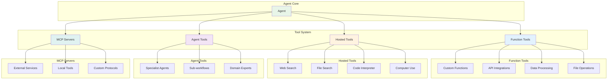
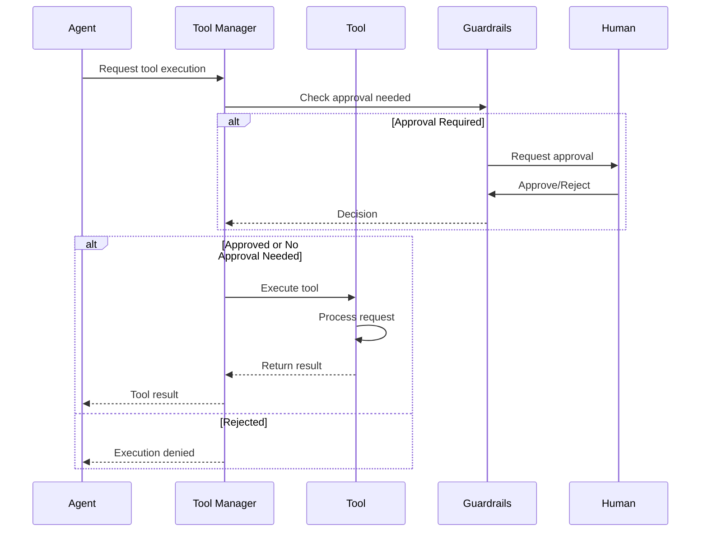
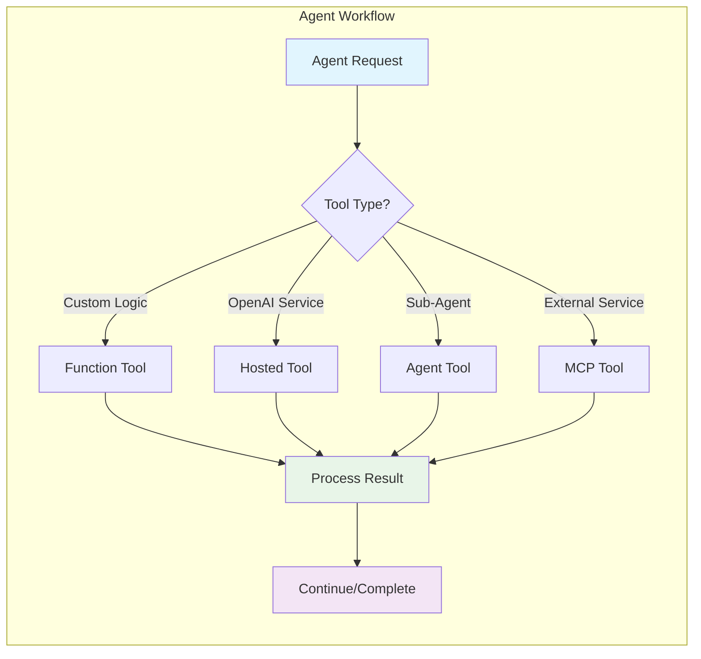

# Tools System - OpenAI Agents JS SDK

Complete guide to creating, configuring, and using tools in the OpenAI Agents SDK.

> **Official Guide**: [https://openai.github.io/openai-agents-js/guides/tools](https://openai.github.io/openai-agents-js/guides/tools)

## Overview

Tools extend agent capabilities by providing access to external systems, APIs, computations, and other agents. The SDK supports four distinct tool types, each optimized for different use cases.

## Tool Types Architecture



## Tool Types

### 1. Function Tools

Convert JavaScript functions into callable agent tools with automatic schema generation.

#### Basic Function Tool
```typescript
import { tool } from '@openai/agents';
import { z } from 'zod';

const weatherTool = tool({
  name: 'get_weather',
  description: 'Get current weather conditions for a specified city',
  parameters: z.object({
    city: z.string().describe('The city name'),
    units: z.enum(['celsius', 'fahrenheit']).default('celsius')
  }),
  async execute({ city, units }) {
    try {
      const weather = await fetchWeatherAPI(city);
      return `Weather in ${city}: ${weather.temperature}°${units[0].toUpperCase()}, ${weather.condition}`;
    } catch (error) {
      throw new Error(`Failed to get weather for ${city}: ${error.message}`);
    }
  }
});
```

#### Advanced Function Tool Patterns

**Validation and Error Handling**
```typescript
const databaseTool = tool({
  name: 'query_database',
  description: 'Execute SQL queries against the user database',
  parameters: z.object({
    query: z.string().describe('SQL query to execute'),
    limit: z.number().max(100).default(10).describe('Maximum rows to return')
  }),
  async execute({ query, limit }) {
    // Input validation
    if (query.toLowerCase().includes('drop') || query.toLowerCase().includes('delete')) {
      throw new Error('Destructive operations not allowed');
    }

    try {
      const results = await db.query(query, { limit });
      return {
        rows: results.length,
        data: results,
        query: query
      };
    } catch (error) {
      return {
        error: true,
        message: error.message,
        query: query
      };
    }
  }
});
```

**File Operations Tool**
```typescript
const fileOperationsTool = tool({
  name: 'file_operations',
  description: 'Read, write, and manage files',
  parameters: z.object({
    operation: z.enum(['read', 'write', 'list', 'delete']),
    path: z.string().describe('File or directory path'),
    content: z.string().optional().describe('Content to write (for write operation)')
  }),
  async execute({ operation, path, content }) {
    const fs = await import('fs/promises');
    const pathLib = await import('path');

    // Security: restrict to safe directory
    const safePath = pathLib.resolve('./safe-directory', path);
    if (!safePath.startsWith(pathLib.resolve('./safe-directory'))) {
      throw new Error('Path outside safe directory not allowed');
    }

    switch (operation) {
      case 'read':
        return await fs.readFile(safePath, 'utf8');
      case 'write':
        await fs.writeFile(safePath, content || '');
        return `File written successfully: ${path}`;
      case 'list':
        const files = await fs.readdir(safePath);
        return files.join('\n');
      case 'delete':
        await fs.unlink(safePath);
        return `File deleted: ${path}`;
      default:
        throw new Error(`Unknown operation: ${operation}`);
    }
  }
});
```

**HTTP API Tool**
```typescript
const apiTool = tool({
  name: 'api_request',
  description: 'Make HTTP requests to external APIs',
  parameters: z.object({
    url: z.string().url(),
    method: z.enum(['GET', 'POST', 'PUT', 'DELETE']).default('GET'),
    headers: z.record(z.string()).optional(),
    body: z.string().optional()
  }),
  async execute({ url, method, headers, body }) {
    const response = await fetch(url, {
      method,
      headers: {
        'Content-Type': 'application/json',
        ...headers
      },
      body: body ? JSON.stringify(JSON.parse(body)) : undefined
    });

    const responseText = await response.text();

    return {
      status: response.status,
      statusText: response.statusText,
      headers: Object.fromEntries(response.headers.entries()),
      body: responseText
    };
  }
});
```

### 2. Hosted Tools

Built-in OpenAI services accessible through simple function calls.

#### Web Search
```typescript
import { webSearchTool } from '@openai/agents';

const agent = new Agent({
  name: 'Research Assistant',
  instructions: 'Help users find current information from the web',
  tools: [webSearchTool()]
});
```

#### File Search
```typescript
import { fileSearchTool } from '@openai/agents';

const agent = new Agent({
  name: 'Document Assistant',
  instructions: 'Answer questions based on uploaded documents',
  tools: [fileSearchTool()]
});
```

#### Code Interpreter
```typescript
import { codeInterpreterTool } from '@openai/agents';

const agent = new Agent({
  name: 'Data Analyst',
  instructions: 'Analyze data and create visualizations',
  tools: [codeInterpreterTool()]
});
```

#### Computer Use
```typescript
import { computerUseTool } from '@openai/agents';

const agent = new Agent({
  name: 'Automation Assistant',
  instructions: 'Interact with computer interfaces to complete tasks',
  tools: [computerUseTool()]
});
```

### 3. Agent Tools

Convert agents into tools for hierarchical and specialized agent interactions.

#### Basic Agent as Tool
```typescript
const mathAgent = new Agent({
  name: 'Math Specialist',
  instructions: 'Solve mathematical problems step by step',
  tools: [calculatorTool, graphTool]
});

const generalAgent = new Agent({
  name: 'General Assistant',
  instructions: 'Help with various tasks, delegate math to specialist',
  tools: [
    mathAgent.asTool(),
    webSearchTool(),
    emailTool
  ]
});
```

#### Specialized Agent Network
```typescript
const codeReviewAgent = new Agent({
  name: 'Code Reviewer',
  instructions: 'Review code for bugs, style, and best practices',
  tools: [staticAnalysisTool, testRunnerTool]
});

const documentationAgent = new Agent({
  name: 'Documentation Generator',
  instructions: 'Create comprehensive documentation for code',
  tools: [parseCodeTool, templateTool]
});

const techLeadAgent = new Agent({
  name: 'Technical Lead',
  instructions: 'Coordinate code reviews and documentation',
  tools: [
    codeReviewAgent.asTool(),
    documentationAgent.asTool(),
    projectManagementTool
  ]
});
```

### 4. MCP Servers

Connect to Model Context Protocol servers for external tool integration.

#### Local MCP Server
```typescript
import { MCPServerStdio } from '@openai/agents';

const mcpServer = new MCPServerStdio({
  command: 'node',
  args: ['./custom-mcp-server.js'],
  env: { API_KEY: process.env.EXTERNAL_API_KEY }
});

const agent = new Agent({
  name: 'MCP-Enabled Agent',
  instructions: 'Use external tools via MCP server',
  tools: [mcpServer]
});
```

## Tool Configuration

## Tool Execution Flow



### Human-in-the-Loop Approval

```typescript
const sensitiveOperationTool = tool({
  name: 'delete_user_data',
  description: 'Delete user account and all associated data',
  parameters: z.object({
    userId: z.string(),
    confirmation: z.literal('DELETE_CONFIRMED')
  }),
  needsApproval: true, // Always require approval
  async execute({ userId, confirmation }) {
    await deleteUserData(userId);
    return `User ${userId} data deleted successfully`;
  }
});

// Conditional approval
const emailTool = tool({
  name: 'send_email',
  description: 'Send email to specified recipient',
  parameters: z.object({
    to: z.string().email(),
    subject: z.string(),
    body: z.string()
  }),
  needsApproval: (params) => {
    // Require approval for external emails
    return !params.to.endsWith('@mycompany.com');
  },
  async execute({ to, subject, body }) {
    await sendEmail({ to, subject, body });
    return `Email sent to ${to}`;
  }
});
```

### Tool Result Formatting

```typescript
const analyticsTool = tool({
  name: 'get_analytics',
  description: 'Retrieve website analytics data',
  parameters: z.object({
    metric: z.enum(['pageviews', 'users', 'sessions']),
    startDate: z.string(),
    endDate: z.string()
  }),
  async execute({ metric, startDate, endDate }) {
    const data = await getAnalyticsData(metric, startDate, endDate);

    // Return structured, easy-to-understand format
    return {
      metric,
      period: `${startDate} to ${endDate}`,
      value: data.total,
      change: data.changeFromPrevious,
      changePercent: data.changePercent,
      chartData: data.dailyValues,
      summary: `${metric} ${data.changePercent > 0 ? 'increased' : 'decreased'} by ${Math.abs(data.changePercent)}%`
    };
  }
});
```

## Advanced Tool Patterns

### Tool Composition

```typescript
const compositeSearchTool = tool({
  name: 'comprehensive_search',
  description: 'Search across web, documents, and database',
  parameters: z.object({
    query: z.string(),
    sources: z.array(z.enum(['web', 'docs', 'db'])).default(['web', 'docs', 'db'])
  }),
  async execute({ query, sources }) {
    const results = await Promise.allSettled([
      sources.includes('web') ? webSearch(query) : null,
      sources.includes('docs') ? documentSearch(query) : null,
      sources.includes('db') ? databaseSearch(query) : null
    ]);

    return {
      query,
      sources: sources.join(', '),
      results: results.map((result, index) => ({
        source: ['web', 'docs', 'db'][index],
        status: result.status,
        data: result.status === 'fulfilled' ? result.value : result.reason
      }))
    };
  }
});
```

### Caching Tools

```typescript
const cache = new Map();

const expensiveComputationTool = tool({
  name: 'expensive_computation',
  description: 'Perform CPU-intensive calculation with caching',
  parameters: z.object({
    input: z.string(),
    useCache: z.boolean().default(true)
  }),
  async execute({ input, useCache }) {
    const cacheKey = `computation:${input}`;

    if (useCache && cache.has(cacheKey)) {
      return {
        result: cache.get(cacheKey),
        cached: true,
        computedAt: new Date().toISOString()
      };
    }

    const result = await performExpensiveComputation(input);

    if (useCache) {
      cache.set(cacheKey, result);
    }

    return {
      result,
      cached: false,
      computedAt: new Date().toISOString()
    };
  }
});
```

### Streaming Tools

```typescript
const longRunningTool = tool({
  name: 'process_large_dataset',
  description: 'Process large dataset with progress updates',
  parameters: z.object({
    datasetId: z.string(),
    batchSize: z.number().default(100)
  }),
  async execute({ datasetId, batchSize }) {
    const dataset = await loadDataset(datasetId);
    const totalItems = dataset.length;
    let processed = 0;
    const results = [];

    for (let i = 0; i < totalItems; i += batchSize) {
      const batch = dataset.slice(i, i + batchSize);
      const batchResults = await processBatch(batch);
      results.push(...batchResults);
      processed += batch.length;

      // Yield progress (if streaming supported)
      if (typeof self !== 'undefined' && self.postMessage) {
        self.postMessage({
          type: 'progress',
          progress: processed / totalItems,
          processed,
          total: totalItems
        });
      }
    }

    return {
      datasetId,
      itemsProcessed: processed,
      results: results.slice(0, 10), // Return sample
      summary: `Processed ${processed} items successfully`
    };
  }
});
```

## Tool Best Practices

### Schema Design
```typescript
// Good: Clear, descriptive parameters
const goodTool = tool({
  name: 'send_notification',
  description: 'Send push notification to user',
  parameters: z.object({
    userId: z.string().describe('Target user ID'),
    title: z.string().max(50).describe('Notification title (max 50 chars)'),
    message: z.string().max(200).describe('Notification body (max 200 chars)'),
    priority: z.enum(['low', 'normal', 'high']).default('normal'),
    scheduleAt: z.string().datetime().optional().describe('ISO datetime to schedule notification')
  }),
  async execute(params) { /* implementation */ }
});

// Bad: Unclear parameters
const badTool = tool({
  name: 'notify',
  parameters: z.object({
    u: z.string(), // Unclear parameter name
    msg: z.string() // No constraints or description
  }),
  async execute(params) { /* implementation */ }
});
```

### Error Handling
```typescript
const robustTool = tool({
  name: 'robust_api_call',
  description: 'Make API call with retry logic and proper error handling',
  parameters: z.object({
    endpoint: z.string().url(),
    maxRetries: z.number().min(0).max(5).default(3)
  }),
  async execute({ endpoint, maxRetries }) {
    let lastError;

    for (let attempt = 0; attempt <= maxRetries; attempt++) {
      try {
        const response = await fetch(endpoint);

        if (!response.ok) {
          throw new Error(`HTTP ${response.status}: ${response.statusText}`);
        }

        return {
          success: true,
          data: await response.json(),
          attempt: attempt + 1
        };
      } catch (error) {
        lastError = error;

        if (attempt < maxRetries) {
          const delay = Math.pow(2, attempt) * 1000; // Exponential backoff
          await new Promise(resolve => setTimeout(resolve, delay));
        }
      }
    }

    return {
      success: false,
      error: lastError.message,
      attempts: maxRetries + 1
    };
  }
});
```

### Security Considerations
```typescript
const secureFileTool = tool({
  name: 'secure_file_access',
  description: 'Safely access files with security checks',
  parameters: z.object({
    path: z.string(),
    operation: z.enum(['read', 'write'])
  }),
  async execute({ path, operation }) {
    // Path traversal prevention
    const safePath = path.replace(/\.\./g, '');

    // Whitelist allowed directories
    const allowedPaths = ['/safe-directory', '/uploads'];
    const isAllowed = allowedPaths.some(allowed =>
      safePath.startsWith(allowed)
    );

    if (!isAllowed) {
      throw new Error(`Access denied: ${path} is not in allowed directories`);
    }

    // File type restrictions
    const allowedExtensions = ['.txt', '.json', '.csv'];
    const hasAllowedExtension = allowedExtensions.some(ext =>
      safePath.endsWith(ext)
    );

    if (!hasAllowedExtension) {
      throw new Error(`File type not allowed: ${path}`);
    }

    // Proceed with operation...
  }
});
```

## Tool Integration Patterns



## References

### Official Documentation
- 📚 [Tools Guide](https://openai.github.io/openai-agents-js/guides/tools)
- 🔧 [Function Tools](https://openai.github.io/openai-agents-js/guides/tools#function-tools)
- 🌐 [Hosted Tools](https://openai.github.io/openai-agents-js/guides/tools#hosted-tools)
- 🤖 [Agent Tools](https://openai.github.io/openai-agents-js/guides/tools#agents-as-tools)
- 🔌 [MCP Integration](https://openai.github.io/openai-agents-js/guides/tools#local-mcp-servers)

### Related Guides
- 🛡️ [Human-in-the-loop](https://openai.github.io/openai-agents-js/guides/human-in-the-loop)
- 🔒 [Guardrails](https://openai.github.io/openai-agents-js/guides/guardrails)

This comprehensive tools system enables agents to interact with virtually any external system while maintaining security and reliability.