# Phase 0: Repository & Documentation Foundation
**Duration: 3-4 days | Goal: Professional Open Source Repository with Complete Documentation**

> **Status**: Planning Phase
> **Depends on**: None
> **Next Phase**: [Phase 1](phase1.md)

## 🎯 Phase 0 Objectives

- **GitHub Repository**: Professional setup with all open source best practices
- **Documentation Site**: Complete GitHub Pages site with Jekyll
- **Legal Framework**: MIT license, security policy, contributing guidelines
- **Community Setup**: Issue templates, PR workflows, contribution process
- **Foundation**: Directory structure, CI/CD pipeline, initial commit

## 📅 Timeline & Schedule

```mermaid
gantt
    title Phase 0: Repository & Documentation Foundation
    dateFormat X
    axisFormat Day %d

    section Repository Setup
    GitHub Repo Creation   :crit, milestone, repo, 0, 1
    Open Source Setup      :crit, license, 1, 2
    Documentation Site     :crit, docs, 2, 4
    Community Setup        :community, 3, 4

    section Milestones
    Phase 0 Complete       :milestone, p0done, 4, 0
```



**Phase 0 Daily Assignment:**
- **Day 1**: GitHub repository creation, basic configuration, and settings
- **Day 2**: MIT license, security policy, legal framework setup
- **Day 3**: Complete documentation site structure with Jekyll
- **Day 4**: Community templates, contributing guidelines, initial commit

---

## 📋 Complete Task Breakdown

### 📦 **0. GitHub Repository & Open Source Setup (Days 1-4)**
> **Foundation Phase** - Must complete before Phase 1 development

#### 0.1 Repository Creation & Configuration
- [ ] **0.1.1** Create GitHub repository `agents-cli`
  - Repository name: `agents-cli`
  - Description: "Multi-agent workflow engine for agentic IDEs using OpenAI Agents SDK"
  - Visibility: Public (for open source adoption)
  - Initialize with README, .gitignore (Node.js), and LICENSE (MIT)
- [ ] **0.1.2** Configure repository settings:
  - Add topics: `agents`, `openai`, `mcp`, `ide-integration`, `typescript`, `workflow-engine`
  - Enable Issues, Wiki, Discussions, Projects
  - Set default branch to `main`
  - Enable "Automatically delete head branches" for cleanup
- [ ] **0.1.3** Set up branch protection rules for `main` branch:
  - Require pull request reviews before merging
  - Require status checks to pass (CI tests)
  - Require branches to be up to date before merging
  - Include administrators in restrictions
- [ ] **0.1.4** Create initial repository labels:
  - `phase-0`, `phase-1`, `phase-2` (for project phases)
  - `ide-integration`, `mcp-protocol`, `security` (for feature areas)
  - `bug`, `enhancement`, `documentation` (standard labels)

#### 0.2 GitHub Actions & Secrets Setup
- [ ] **0.2.1** Configure repository secrets for CI/CD:
  ```
  OPENAI_API_KEY=sk-... (for integration tests - use test key with low quota)
  NPM_TOKEN=npm_... (for package publishing to npm registry)
  ```
- [ ] **0.2.2** Set up GitHub Actions permissions:
  - Enable "Read and write permissions" for GITHUB_TOKEN
  - Allow GitHub Actions to create and approve pull requests
- [ ] **0.2.3** Create placeholder GitHub Actions workflow file:
  ```yaml
  # .github/workflows/ci.yml (basic structure for now)
  name: CI
  on: [push, pull_request]
  jobs:
    setup:
      runs-on: ubuntu-latest
      steps:
        - uses: actions/checkout@v4
        - run: echo "Repository setup complete"
  ```

#### 0.3 Repository Templates & Documentation
- [ ] **0.3.1** Create issue templates in `.github/ISSUE_TEMPLATE/`:
  ```markdown
  # bug_report.yml - Bug report template
  # feature_request.yml - Feature request template
  # ide_integration.yml - IDE integration request template
  ```
- [ ] **0.3.2** Create pull request template `.github/pull_request_template.md`:
  ```markdown
  ## Description
  Brief description of changes

  ## Type of Change
  - [ ] Bug fix
  - [ ] New feature
  - [ ] Documentation update
  - [ ] Refactoring

  ## Testing
  - [ ] Tests pass locally
  - [ ] Added/updated tests for changes
  - [ ] Manual testing completed

  ## Phase 0/1 Checklist (if applicable)
  - [ ] Task corresponds to phase documentation
  - [ ] Security considerations addressed
  - [ ] MCP protocol compliance maintained
  ```
- [ ] **0.3.3** Create `CONTRIBUTING.md` with development guidelines:
  ```markdown
  # Contributing to Agents CLI

  ## Development Setup
  1. Fork and clone the repository
  2. Install dependencies: `npm install`
  3. Run tests: `npm test`
  4. Start development: `npm run dev`

  ## Phase Development
  - Follow task breakdown in docs/tasks/
  - All changes require tests and documentation
  - Security-first approach for all tool integrations
  ```

#### 0.4 Open Source Licensing & Legal Setup
- [ ] **0.4.1** Create comprehensive LICENSE file (MIT License):
  ```
  MIT License

  Copyright (c) 2024 Agents CLI Contributors

  Permission is hereby granted, free of charge, to any person obtaining a copy
  of this software and associated documentation files (the "Software"), to deal
  in the Software without restriction, including without limitation the rights
  to use, copy, modify, merge, publish, distribute, sublicense, and/or sell
  copies of the Software...
  ```
- [ ] **0.4.2** Add LICENSE notice to package.json and all source files
- [ ] **0.4.3** Create SECURITY.md for vulnerability reporting:
  ```markdown
  # Security Policy

  ## Supported Versions
  | Version | Supported |
  |---------|-----------|
  | 0.1.x   | ✅        |

  ## Reporting a Vulnerability
  Please report security vulnerabilities to security@agents-cli.org
  ```

#### 0.5 GitHub Pages Documentation Setup
- [ ] **0.5.1** Create docs website structure:
  ```
  docs/
  ├── index.md                    # Homepage
  ├── getting-started/            # Installation & setup
  │   ├── installation.md
  │   ├── quick-start.md
  │   └── configuration.md
  ├── guides/                     # User guides
  │   ├── ide-integration.md
  │   ├── workflow-patterns.md
  │   └── security.md
  ├── api/                        # API documentation
  │   ├── cli-reference.md
  │   ├── mcp-protocol.md
  │   └── configuration-schema.md
  ├── examples/                   # Example workflows
  │   ├── code-review.md
  │   ├── architecture-review.md
  │   └── custom-workflows.md
  ├── contributing/               # Development docs
  │   ├── development-setup.md
  │   ├── architecture.md
  │   └── phase-roadmap.md
  └── _config.yml                # Jekyll configuration
  ```

- [ ] **0.5.2** Set up Jekyll configuration (`docs/_config.yml`):
  ```yaml
  title: Agents CLI Documentation
  description: Multi-agent workflow engine for agentic IDEs
  url: https://agents-cli.github.io
  baseurl: /agents-cli

  # Theme
  theme: jekyll-theme-cayman

  # Navigation
  plugins:
    - jekyll-feed
    - jekyll-sitemap
    - jekyll-seo-tag

  # Social links
  github:
    repository_url: https://github.com/agents-cli/agents-cli

  # OpenGraph
  logo: assets/img/agents-cli-logo.png
  social:
    name: Agents CLI
    links:
      - https://github.com/agents-cli/agents-cli
  ```

- [ ] **0.5.3** Create comprehensive documentation homepage (`docs/index.md`):
  ```markdown
  ---
  layout: default
  title: Agents CLI - Multi-Agent Workflows for IDEs
  description: Open source workflow engine enabling agentic IDEs to execute sophisticated multi-agent workflows
  ---

  # Agents CLI

  **Multi-agent workflow engine for agentic IDEs using OpenAI Agents SDK**

  ## 🚀 What is Agents CLI?

  Agents CLI enables agentic IDEs (Cursor, VS Code, etc.) to dynamically create and execute sophisticated multi-agent workflows. Define agents, tools, and orchestration patterns through JSON configuration and receive structured outputs optimized for IDE consumption.

  ## 📋 Current Status: Phase 1 Development

  We're currently implementing the foundation and core MCP functionality.
  [View detailed progress →](contributing/phase-roadmap)

  ## 🎯 Key Features

  - **Dual Interface**: CLI and MCP server modes for flexible integration
  - **Configuration-Driven**: JSON-based agent and workflow definitions
  - **Security-First**: Built-in sandboxing and access controls
  - **IDE-Optimized**: Real-time streaming and structured outputs
  - **Extensible**: Plugin architecture for custom tools and workflows

  ## 🔗 Quick Links

  - [Installation Guide](getting-started/installation) *(Coming Soon)*
  - [IDE Integration](guides/ide-integration)
  - [Configuration Reference](api/configuration-schema)
  - [Example Workflows](examples/)
  - [Contributing Guide](contributing/development-setup)

  ## 🏗️ Example Usage

  \```bash
  # Execute a code review workflow
  agents-cli run \\
    --config examples/code-review.json \\
    --input "Review this pull request" \\
    --files "src/**/*.ts"

  # Start MCP server for IDE integration
  agents-cli serve --port 3000
  \```

  ## 🤝 Contributing

  We welcome contributions! This is an open source project under MIT license.

  - [Development Setup](contributing/development-setup)
  - [Architecture Overview](contributing/architecture)
  - [Phase Task Breakdown](contributing/phase-roadmap)

  ## 📄 License

  MIT License - see [LICENSE](https://github.com/agents-cli/agents-cli/blob/main/LICENSE)
  ```

- [ ] **0.5.4** Enable GitHub Pages in repository settings:
  - Go to repository Settings → Pages
  - Source: "Deploy from a branch"
  - Branch: `main` / `docs`
  - Custom domain: (optional) `agents-cli.dev`

- [ ] **0.5.5** Create GitHub Pages deployment action (`.github/workflows/docs.yml`):
  ```yaml
  name: Deploy Documentation

  on:
    push:
      branches: [ main ]
      paths: [ 'docs/**' ]
    pull_request:
      branches: [ main ]
      paths: [ 'docs/**' ]

  permissions:
    contents: read
    pages: write
    id-token: write

  jobs:
    build:
      runs-on: ubuntu-latest
      steps:
        - uses: actions/checkout@v4

        - name: Setup Pages
          uses: actions/configure-pages@v4

        - name: Build with Jekyll
          uses: actions/jekyll-build-pages@v1
          with:
            source: ./docs
            destination: ./_site

        - name: Upload artifact
          uses: actions/upload-pages-artifact@v2

    deploy:
      if: github.ref == 'refs/heads/main'
      environment:
        name: github-pages
        url: ${{ steps.deployment.outputs.page_url }}
      runs-on: ubuntu-latest
      needs: build
      steps:
        - name: Deploy to GitHub Pages
          id: deployment
          uses: actions/deploy-pages@v3
  ```

#### 0.6 Initial Repository Content
- [ ] **0.6.1** Update README.md with comprehensive project overview:
  ```markdown
  # Agents CLI

  [](https://github.com/agents-cli/agents-cli/actions)
  [](https://opensource.org/licenses/MIT)
  [](https://agents-cli.github.io/agents-cli)

  **Multi-agent workflow engine for agentic IDEs using OpenAI Agents SDK**

  > 🚧 **Status**: Phase 1 Development - Foundation and MCP core functionality
  >
  > 📖 **Documentation**: [agents-cli.github.io/agents-cli](https://agents-cli.github.io/agents-cli)

  ## What is Agents CLI?

  Agents CLI enables agentic IDEs (Cursor, VS Code, etc.) to dynamically create and execute sophisticated multi-agent workflows. Define agents, tools, and orchestration patterns through JSON configuration and receive structured outputs optimized for IDE consumption.

  ### Key Features

  - 🔄 **Dual Interface**: CLI and MCP server modes
  - ⚙️ **Configuration-Driven**: JSON-based agent definitions
  - 🔒 **Security-First**: Built-in sandboxing and access controls
  - 💻 **IDE-Optimized**: Real-time streaming and structured outputs
  - 🧩 **Extensible**: Plugin architecture for custom tools

  ## Quick Start (Coming Soon)

  \```bash
  # Install globally
  npm install -g agents-cli

  # Execute a workflow
  agents-cli run --config examples/code-review.json --input "Review this code"

  # Start MCP server for IDE integration
  agents-cli serve --port 3000
  \```

  ## Documentation

  📖 **[Complete Documentation](https://agents-cli.github.io/agents-cli)**

  - [Installation Guide](https://agents-cli.github.io/agents-cli/getting-started/installation)
  - [IDE Integration](https://agents-cli.github.io/agents-cli/guides/ide-integration)
  - [Configuration Reference](https://agents-cli.github.io/agents-cli/api/configuration-schema)
  - [Example Workflows](https://agents-cli.github.io/agents-cli/examples/)

  ## Contributing

  We welcome contributions! This is an open source project under MIT license.

  - 🛠️ [Development Setup](https://agents-cli.github.io/agents-cli/contributing/development-setup)
  - 🏗️ [Architecture Overview](https://agents-cli.github.io/agents-cli/contributing/architecture)
  - 📋 [Phase Task Breakdown](https://agents-cli.github.io/agents-cli/contributing/phase-roadmap)

  ## License

  MIT License - see [LICENSE](LICENSE) for details.

  ## Status & Roadmap

  **Current Phase**: Foundation + MCP Core (Phase 1)
  - ✅ Repository & documentation setup (Phase 0)
  - 🚧 Configuration schema design
  - 🚧 MCP server implementation
  - ⏳ OpenAI SDK integration
  - ⏳ Basic workflow execution

  [View detailed progress →](https://agents-cli.github.io/agents-cli/contributing/phase-roadmap)
  ```

- [ ] **0.6.2** Create basic project structure directories:
  ```bash
  mkdir -p src/{cli,config,agents,mcp,tools,security,workflows,utils}
  mkdir -p tests/{unit,integration,fixtures}
  mkdir -p examples docs/tasks

  # Documentation structure
  mkdir -p docs/{getting-started,guides,api,examples,contributing}
  mkdir -p docs/assets/{img,css,js}
  ```

- [ ] **0.6.3** Initial commit and push to remote:
  ```bash
  git add .
  git commit -m "Initial open source repository setup

  - GitHub repository configuration with open source best practices
  - MIT license and security policy
  - GitHub Pages documentation site with Jekyll
  - Issue and PR templates for community contributions
  - Comprehensive README with badges and documentation links
  - Basic project structure for Phase 1 development

  🤖 Generated with [Claude Code](https://claude.ai/code)

  Co-Authored-By: Claude <noreply@anthropic.com>"
  git push origin main
  ```

---

## ✅ Definition of Done - Phase 0

**🎯 Must Complete:**
- [ ] ✅ GitHub repository created and configured professionally
- [ ] ✅ Complete documentation site deployed on GitHub Pages
- [ ] ✅ MIT license and legal framework in place
- [ ] ✅ Issue templates and PR workflows configured
- [ ] ✅ Repository structure created for development
- [ ] ✅ Initial commit pushed with all foundation files

**📊 Quality Gates:**
- [ ] Documentation site accessible and properly formatted
- [ ] All repository settings configured correctly
- [ ] GitHub Actions workflows properly set up
- [ ] Community templates functional and professional
- [ ] Legal framework complete and compliant

**🚀 Success Criteria:**
- Repository ready for open source contributions
- Documentation provides clear project overview
- Community can easily understand and contribute
- Foundation ready for Phase 1 development
- Professional appearance matching open source best practices

---

## 🔄 Next Steps

Upon Phase 0 completion:
- **Professional Repository** ready for community
- **Complete Documentation** site live on GitHub Pages
- **Legal Framework** established for open source
- **Development Foundation** prepared for Phase 1

**Next Phase**: [Phase 1: Core Development](phase1.md) - CLI, MCP server, and OpenAI SDK integration

---

## 📚 Related Documents

- **[Project PRD](../PRD.md)** - Overall project requirements and canonical task entrypoint
- **[Phase 1: Core Development](phase1.md)** - Next implementation phase
