# Phase 1: Core Development Foundation
**Duration: 2 weeks (14 days) | Goal: Working CLI + Basic MCP Server + OpenAI SDK Integration**

> **Status**: Ready to begin
> **Depends on**: [Phase 0](phase0.md) completion
> **Previous Phase**: [Phase 0: Repository & Documentation](phase0.md)

## 🎯 Phase 1 Objectives

- **CLI Interface**: Working `agents-cli` command with basic workflow execution
- **MCP Server**: Basic server that IDEs can connect to and execute tools
- **Configuration System**: JSON-based agent and workflow definitions
- **Security Framework**: Safe tool execution with sandboxing
- **OpenAI Integration**: Adapter pattern for SDK integration
- **Testing & Quality**: Comprehensive test suite and CI/CD

## 📅 Timeline & Schedule

```mermaid
gantt
    title Phase 1 Critical Path (After Phase 0)
    dateFormat X
    axisFormat Day %d

    section Foundation
    Project Setup          :crit, milestone, setup, 0, 2
    Schema Design          :crit, schema, 1, 3
    Security Framework     :crit, security, 3, 5

    section Core Systems
    MCP Server             :crit, mcp, 2, 6
    CLI Framework          :cli, 1, 5
    SDK Integration        :crit, sdk, 4, 8

    section Integration
    Workflow Engine        :workflow, 6, 8
    Integration Testing    :testing, 7, 9

    section Milestones
    Alpha Release          :milestone, alpha, 9, 0
```

**Phase 1 Daily Assignment (After Phase 0):**
- **Day 1-2**: Node.js project setup and TypeScript configuration
- **Day 3-5**: Configuration schema design and validation system
- **Day 4-7**: CLI framework and command interface development
- **Day 6-9**: MCP server basic implementation and tool registration
- **Day 8-11**: Security layer, API key handling, and sandboxing
- **Day 9-13**: OpenAI SDK integration with adapter pattern
- **Day 11-13**: Basic workflow engine and execution patterns
- **Day 12-14**: Integration testing and quality assurance

---

## 📋 Complete Task Breakdown

### 📦 **1. Project Setup & Infrastructure (Days 1-2)**
> **Critical Path** - Blocks all other development
> **Depends on**: Phase 0 completion

#### 1.1 Repository & Package Setup
- [ ] **1.1.1** Initialize Node.js project with TypeScript
- [ ] **1.1.2** Install core dependencies (OpenAI Agents SDK, Commander.js, Zod, etc.)
- [ ] **1.1.3** Configure ESLint + Prettier with strict rules
- [ ] **1.1.4** Set up Jest testing framework with TypeScript
- [ ] **1.1.5** Create comprehensive GitHub Actions CI workflow

#### 1.2 Project Structure Setup
- [ ] **1.2.1** Expand directory structure for development
- [ ] **1.2.2** Set up TypeScript path aliases and barrel exports
- [ ] **1.2.3** Initialize example workflow configurations
- [ ] **1.2.4** Create development and build scripts

---

### 🏗️ **2. Schema Design & Validation (Days 3-5)**
> **Critical Path** - Enables configuration and validation

#### 2.1 Core Configuration Schema
- [ ] **2.1.1** Design `AgentConfig` schema with Zod validation
- [ ] **2.1.2** Create `WorkflowSettings` schema for execution patterns
- [ ] **2.1.3** Define `ToolConfig` schema for different tool types

#### 2.2 Configuration Loading & Validation
- [ ] **2.2.1** Create `ConfigLoader` class with file format support
- [ ] **2.2.2** Implement detailed schema validation with user-friendly errors
- [ ] **2.2.3** Add configuration merge support (defaults + user config)
- [ ] **2.2.4** Create validation CLI command

#### 2.3 Example Configurations
- [ ] **2.3.1** Create comprehensive code review workflow example
- [ ] **2.3.2** Create architecture review workflow example
- [ ] **2.3.3** Create minimal single-agent example
- [ ] **2.3.4** Generate schema documentation from Zod definitions

---

### 🔌 **3. MCP Server Basic Implementation (Days 6-9)**
> **Critical Path** - Essential for IDE integration

#### 3.1 MCP Protocol Foundation
- [ ] **3.1.1** Install and study MCP TypeScript dependencies
- [ ] **3.1.2** Create `AgentsMCPServer` base class with proper initialization
- [ ] **3.1.3** Implement core MCP protocol message handling

#### 3.2 Tool Registration System
- [ ] **3.2.1** Create `MCPTool` interface with comprehensive type safety
- [ ] **3.2.2** Implement tool registry with validation and discovery
- [ ] **3.2.3** Create tool result formatting for MCP responses
- [ ] **3.2.4** Add comprehensive error handling and logging

#### 3.3 Basic Built-in Tools
- [ ] **3.3.1** Implement `echo_tool` for testing MCP connections
- [ ] **3.3.2** Implement `file_read_tool` with security restrictions
- [ ] **3.3.3** Create additional utility tools for basic operations

#### 3.4 MCP Server Testing
- [ ] **3.4.1** Create comprehensive MCP server integration tests
- [ ] **3.4.2** Build manual testing scripts for development
- [ ] **3.4.3** Test actual IDE integration (Cursor/VS Code)
- [ ] **3.4.4** Validate MCP protocol compliance

---

### 💻 **4. CLI Framework & Interface (Days 4-7)**

#### 4.1 CLI Command Structure
- [ ] **4.1.1** Set up Commander.js with TypeScript
- [ ] **4.1.2** Implement `run` command with comprehensive options
- [ ] **4.1.3** Implement `validate` command for configuration testing
- [ ] **4.1.4** Implement `serve` command for MCP server mode

#### 4.2 Command Handlers
- [ ] **4.2.1** Create `RunWorkflowCommand` with full workflow execution
- [ ] **4.2.2** Create `ValidateCommand` with detailed validation feedback
- [ ] **4.2.3** Create `ServeCommand` for MCP server startup
- [ ] **4.2.4** Add global error handling with appropriate exit codes

#### 4.3 Output Formatting
- [ ] **4.3.1** Create console formatter with Chalk for colored output
- [ ] **4.3.2** Implement structured JSON output writer
- [ ] **4.3.3** Add streaming progress indicators
- [ ] **4.3.4** Create results summary formatter

---

### 🔒 **5. Security Layer & API Key Handling (Days 8-11)**
> **Critical Path** - Required for safe tool execution

#### 5.1 Security Policy Framework
- [ ] **5.1.1** Create comprehensive `SecurityPolicy` interface
- [ ] **5.1.2** Implement `SecurityPolicyValidator` with file/network access controls
- [ ] **5.1.3** Create default security policies for different environments
- [ ] **5.1.4** Add security policy loading and validation

#### 5.2 API Key & Credential Management
- [ ] **5.2.1** Create secure credential manager with memory-only storage
- [ ] **5.2.2** Implement environment variable validation with warnings
- [ ] **5.2.3** Add secure credential file support with permissions validation
- [ ] **5.2.4** Create comprehensive logging redaction for API keys

#### 5.3 Tool Execution Sandboxing
- [ ] **5.3.1** Create `ToolExecutionContext` with resource limits
- [ ] **5.3.2** Implement security-wrapped tool execution
- [ ] **5.3.3** Add resource monitoring (memory, CPU, execution time)
- [ ] **5.3.4** Create comprehensive audit logging

#### 5.4 Security Testing
- [ ] **5.4.1** Create security test suite with malicious input scenarios
- [ ] **5.4.2** Test file system access restrictions
- [ ] **5.4.3** Verify API key redaction in all output scenarios
- [ ] **5.4.4** Validate resource limit enforcement

---

### ⚡ **6. OpenAI SDK Integration & Adapter (Days 9-13)**
> **Critical Path** - Core workflow execution capability

#### 6.1 Adapter Pattern Implementation
- [ ] **6.1.1** Create `IAgentRuntime` interface for SDK isolation
- [ ] **6.1.2** Implement `OpenAIAgentRuntime` with full SDK integration
- [ ] **6.1.3** Create `IAgent` wrapper interface for abstraction
- [ ] **6.1.4** Add runtime capability detection and validation

#### 6.2 Agent Creation & Management
- [ ] **6.2.1** Create `AgentFactory` with security policy integration
- [ ] **6.2.2** Implement agent configuration translation and validation
- [ ] **6.2.3** Add comprehensive agent lifecycle management
- [ ] **6.2.4** Create agent registry for workflow orchestration

#### 6.3 Basic Workflow Execution
- [ ] **6.3.1** Create `WorkflowEngine` with handoff chain support
- [ ] **6.3.2** Implement basic handoff logic using SDK native capabilities
- [ ] **6.3.3** Add workflow state tracking and turn management
- [ ] **6.3.4** Create result aggregation and structured formatting

#### 6.4 Tool Integration Bridge
- [ ] **6.4.1** Create tool adapter for SDK integration
- [ ] **6.4.2** Implement security-wrapped tool execution
- [ ] **6.4.3** Add tool result formatting for agent consumption
- [ ] **6.4.4** Create comprehensive tool error handling

#### 6.5 Integration Testing
- [ ] **6.5.1** Create end-to-end workflow tests with real OpenAI API
- [ ] **6.5.2** Test agent creation from various configurations
- [ ] **6.5.3** Validate handoff chains work correctly
- [ ] **6.5.4** Test tool execution through full stack

---

### 🧪 **7. Integration Testing & Quality Assurance (Days 12-14)**

#### 7.1 End-to-End Testing
- [ ] **7.1.1** Create comprehensive integration test suite
- [ ] **7.1.2** Test CLI → MCP → SDK → Agent flow
- [ ] **7.1.3** Validate IDE integration scenarios
- [ ] **7.1.4** Test error handling and recovery scenarios

#### 7.2 Performance Testing
- [ ] **7.2.1** Benchmark CLI startup time (<2s requirement)
- [ ] **7.2.2** Test workflow execution performance (<30s target)
- [ ] **7.2.3** Validate memory usage and resource limits
- [ ] **7.2.4** Test concurrent workflow handling

#### 7.3 Security Validation
- [ ] **7.3.1** Run comprehensive security audit
- [ ] **7.3.2** Verify no credential leakage in logs/outputs
- [ ] **7.3.3** Test tool sandboxing effectiveness
- [ ] **7.3.4** Validate access control enforcement

#### 7.4 Documentation & Examples
- [ ] **7.4.1** Update README with working examples
- [ ] **7.4.2** Create IDE integration documentation
- [ ] **7.4.3** Generate API documentation
- [ ] **7.4.4** Validate all examples work correctly

---

## ✅ Definition of Done - Phase 1

**🎯 Must Complete:**
- [ ] ✅ CLI runs `agents-cli run --config example.json` successfully
- [ ] ✅ MCP server starts and registers tools for IDE connection
- [ ] ✅ Security policies prevent unauthorized operations
- [ ] ✅ OpenAI SDK integration executes basic workflows
- [ ] ✅ Configuration validation provides clear error messages
- [ ] ✅ Integration tests cover CLI → MCP → SDK → Agent flow

**📊 Quality Gates:**
- [ ] All unit tests pass (>80% code coverage)
- [ ] Integration tests with real OpenAI API pass
- [ ] Security audit passes (no credential leakage)
- [ ] Performance: CLI startup <2s, workflow execution <30s
- [ ] Documentation: README with working examples

**🚨 Success Criteria:**
- IDE can connect to MCP server and execute basic tools
- Configuration-driven agent creation works
- Security policies prevent file system abuse
- Error handling provides actionable feedback
- Foundation ready for Phase 2 feature expansion

---

## 🔄 Next Steps After Phase 1

Upon completion, Phase 1 delivers:
- **Working CLI** with basic workflow execution
- **MCP Server** ready for IDE integration
- **Security Framework** for safe tool execution
- **OpenAI SDK Integration** with adapter pattern
- **Example Configurations** for common workflows

**Phase 2 Preview**: Advanced tool integrations, parallel workflows, full MCP protocol compliance, and production-ready features.

---

## 📚 Related Documents

- **[Phase 0: Repository Foundation](phase0.md)** - Prerequisites and setup
- **[Project PRD](../PRD.md)** - Overall project requirements and vision
- **[OpenAI Agents SDK Knowledge](../AGENTS.md)** - SDK reference and examples

This Phase 1 task breakdown provides clear, actionable items with dependencies, timelines, and success criteria for core development completion! 🚀